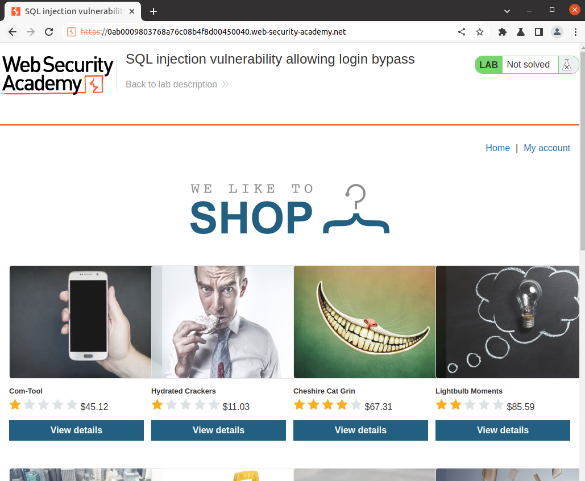
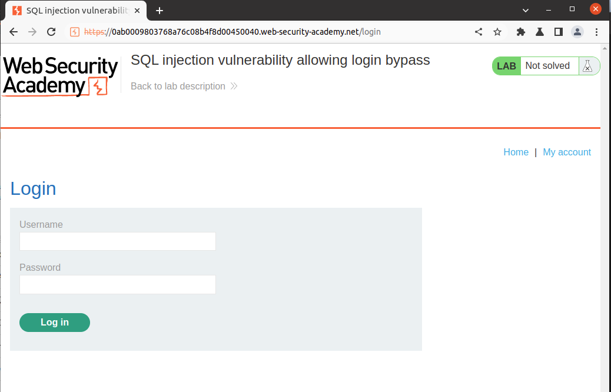
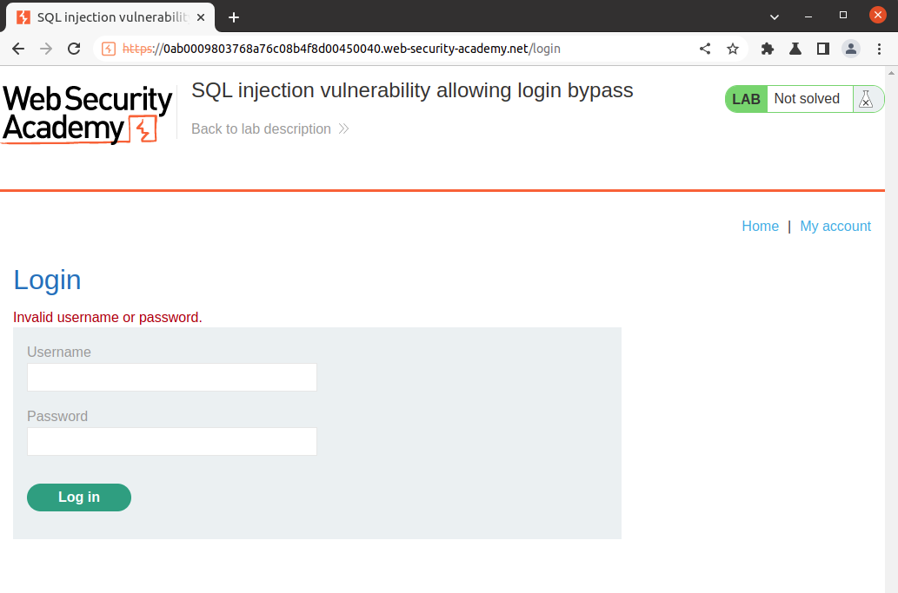
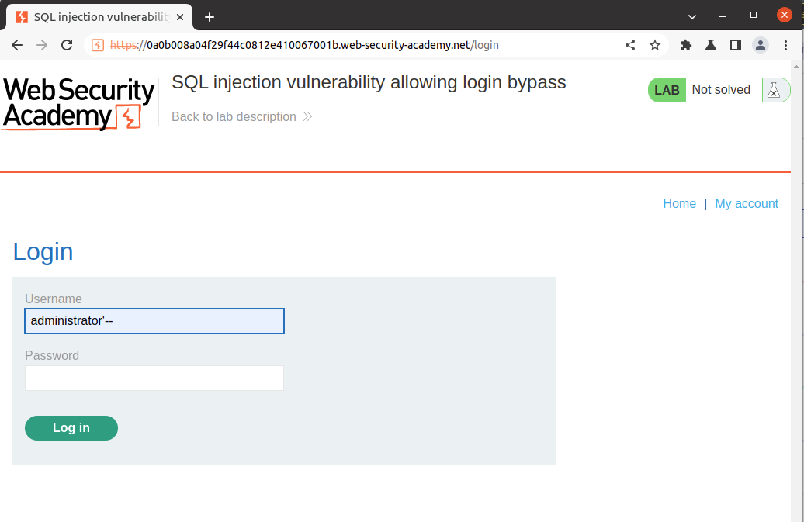
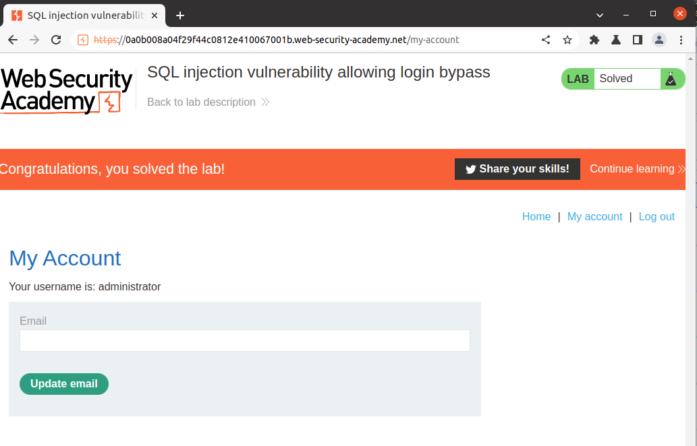

# Lab Description
## Lab: SQL injection vulnerability allowing login bypass

This lab contains an SQL injection vulnerability in the login function.

To solve the lab, perform an SQL injection attack that **logs in to the application as the administrator user**.

# Lab Solution

Authentication bypass is when an unauthenticated user gains access equivalent to an authenticated user without ever going through an authentication procedure. This is usually the result of the usage of an unexpected access procedure that does not go through the proper validation process ([CAPEC-115: Authentication Bypass](https://capec.mitre.org/data/definitions/115.html)[^1]).

One of the ways how to test authentication bypass is through the SQL injection in HTML Form Authentication (https://owasp.org/www-project-web-security-testing-guide/latest/4-Web_Application_Security_Testing/04-Authentication_Testing/04-Testing_for_Bypassing_Authentication_Schema.html)[^2], and that is the aim of this exercise.

The second lab provides us with a similar web application as last time.



However, this time we are presented with the `My account` section instead of the search filter.

After access the link, we are redirected to endpoint `HTTPS://<redacted>.web-security-academy.net/login`, presenting an HTML Login Form with two input fields `Username` and `Password`.




Without access to the code, we can assume that the SQL query, which will be sent to the database looks like the following:

```
SELECT * FROM users WHERE username = 'username' AND password = 'password'
```

The lab description gave us a username: `administrator`. Therefore, we must find the query modification to satisfy the condition, return `TRUE`, and grant us access.

At first, we will send the POST request with an arbitrary password of `0000`.

The SQL query will look like this:

```
SELECT * FROM users WHERE username = 'administrator' AND password = '0000'
```

As we can see in the HTTP response, we received an **Invalid username or password** response due to the incorrect password provided to the application.



Because we do not know the password, we need to modify the SQL query to either validate the condition as TRUE and/or ignore the part where it compares the value of the password with the value stored in the database.
We will use the concept from the first exercise and apply the `--` comment here. This way, as shown in the SQL query below, we will effectively eliminate the password validation and log in as administrator.

```
SELECT * FROM users WHERE username = 'administrator'-- AND password = '0000'
```



The payload worked, and we successfully bypassed the authentication and became administrator.



#### Is there any other way?

To see if other login techniques works, we used the [list of queries for SQL injection authentication bypass](https://pentestlab.blog/2012/12/24/sql-injection-authentication-bypass-cheat-sheet/)[^3] and tested it against the /login webpage.

Because we know the username, we changed the original list's username `admin` to `administrator`.

Again, as the first step, we will send the HTTP POST request with an arbitrary password of `0000`, capture it with proxy and send the captured HTTP POST request to [Intruder](https://portswigger.net/burp/documentation/desktop/tools/intruder/using)[^4].


**HTTP request**
```
POST /login HTTP/1.1
Host: 0ab6008d04381b6bc03f3685007a004e.web-security-academy.net
Content-Type: application/x-www-form-urlencoded
User-Agent: Mozilla/5.0 (Windows NT 10.0; Win64; x64) AppleWebKit/537.36 (KHTML, like Gecko) Chrome/103.0.5060.134 Safari/537.36
Accept: text/html,application/xhtml+xml,application/xml;q=0.9,image/avif,image/webp,image/apng,*/*;q=0.8,application/signed-exchange;v=b3;q=0.9
Connection: close

csrf=AGXPTGACvFjhx8ZHJH8DRvwxUfTU3Ntp&username=administrator&password=0000
```

The following payloads were tested and logged us in as administrator indicating multiple ways how to bypass the authentication process.

```
administrator' --
administrator' or '1'='1
administrator' or '1'='1'--
administrator'or 1=1 or ''='

```

#### Do we need a username?

In this case, the answer is NO.

If we provide application a condition that always evaluates to TRUE, the entire WHERE statement will be TRUE, regardless of the username or password.

[The WHERE statement](https://brightsec.com/blog/sql-injection-attack/)[^5] will then return the first ID from the users table, which is commonly the administrator. This means the unauthenticated user can access the application without authentication and administrator privileges.

Therefore, SQL queries using such inputs give us a passing flag in this exercise. Examples:

```
admin' or '1'='1'--
admin'or 1=1 or ''='
admin' or 1=1--
```

Thank you for reading and see you in the next lab!


[^1]: https://capec.mitre.org/data/definitions/115.html
[^2]: https://owasp.org/www-project-web-security-testing-guide/latest/4-Web_Application_Security_Testing/04-Authentication_Testing/04-Testing_for_Bypassing_Authentication_Schema.html
[^3]: https://pentestlab.blog/2012/12/24/sql-injection-authentication-bypass-cheat-sheet/
[^4]: https://portswigger.net/burp/documentation/desktop/tools/intruder/using
[^5]: https://brightsec.com/blog/sql-injection-attack/
