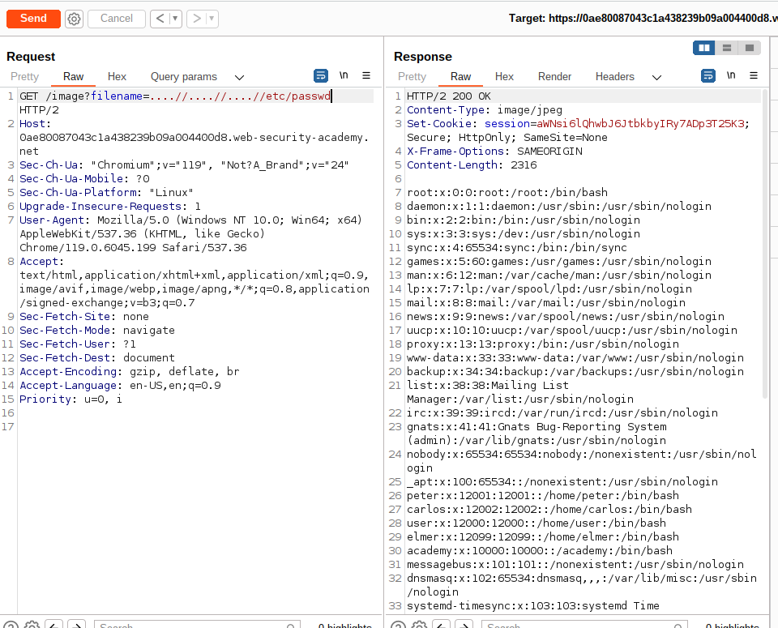

# Lab: File path traversal, traversal sequences stripped non-recursively

## Lab Description

This lab contains a **path traversal vulnerability in the display of product images**.

The application **strips path traversal sequences** from the user-supplied filename before using it.

To solve the lab, retrieve the contents of the `/etc/passwd` file.

## Lab Solution

Pseudo-implementation in python of how the code of exercise might look like
Problem of this code is that it runs non-recursively, therefore, removing only `../` once. If we use nested dot-dot-slash `....//....//`, we can escape this non-recursive path traversal. Alternative sequence which can be used: `....\/`.

```
def sanitize_path(user_input):
    ## Replace any "../" sequences in the input
    sanitized_path = user_input.replace("../", "")
    return sanitized_path

```

1. Use Burp Suite to intercept and modify a request that fetches a product image.
2. Modify the filename parameter, giving it the value:`....//....//....//etc/passwd`
3. Observe that the response contains the contents of the `/etc/passwd` file.


