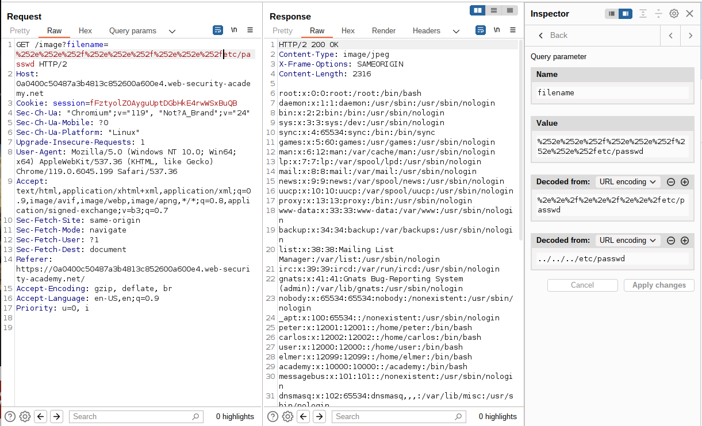
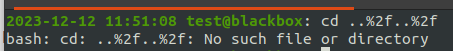

# Lab: File path traversal, traversal sequences stripped with superfluous URL-decode

## Lab Description

This lab contains **a path traversal vulnerability in the display of product images**.

The application **blocks input containing path traversal sequences**. It then performs a **URL-decode of the input** before using it.

To solve the lab, retrieve the contents of the `/etc/passwd` file.

## Lab Solution

Sometimes, it is possible to get around this kind of sanitation by using URL encoding, and in some cases, even double URL encoding, on the characters `../`. This translates to single URL encoded `%2e%2e%2f` and double URL encoded `%252e%252e%252f`, respectively.

If there was no second function to decode the URL encoded characters, the file name would be passed encoded in the function, and there would be no path traversal.

Alternative encoding methods like `..%c0%af` (URL encoded [U+00AF 'MACRON' Unicode Character](https://www.fileformat.info/info/unicode/char/00af/index.htm)) or `..%ef%bc%8f` (URL encoded  [U+FF0F 'Fullwidth Solidus' Unicode Character](https://www.compart.com/en/unicode/U+FF0F)) might also be effective. More details to be found in [why does Directory traversal attack %C0%AF work?](https://security.stackexchange.com/questions/48879/why-does-directory-traversal-attack-c0af-work##:~:text=First%2C%20URL%20encoding%20also%20know%20as%20percent%2Dencoding%20is), [Unicode Injection](https://book.hacktricks.xyz/pentesting-web/unicode-injection), and in old but gold article from Joel Spolsky about [Unicode and Character sets](https://www.joelonsoftware.com/2003/10/08/the-absolute-minimum-every-software-developer-absolutely-positively-must-know-about-unicode-and-character-sets-no-excuses/).
