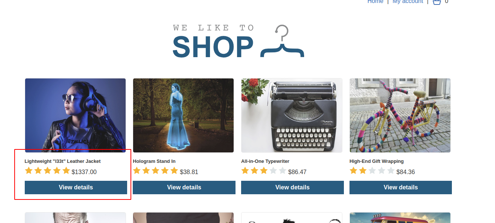
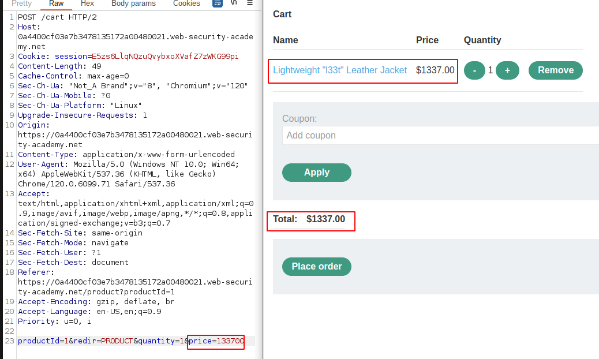
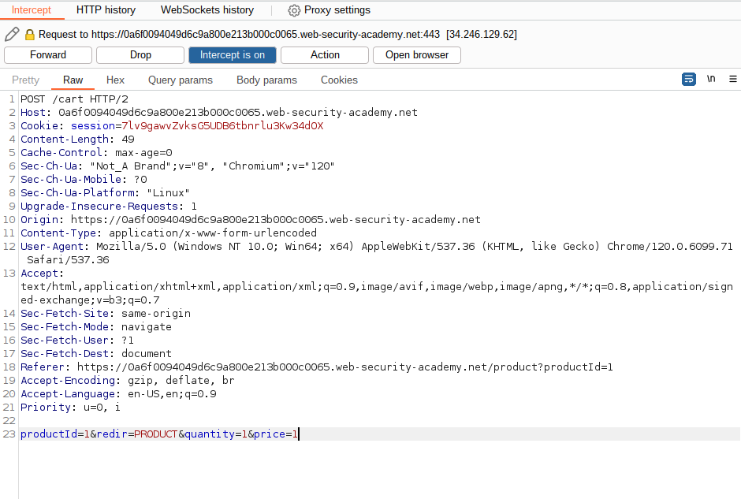
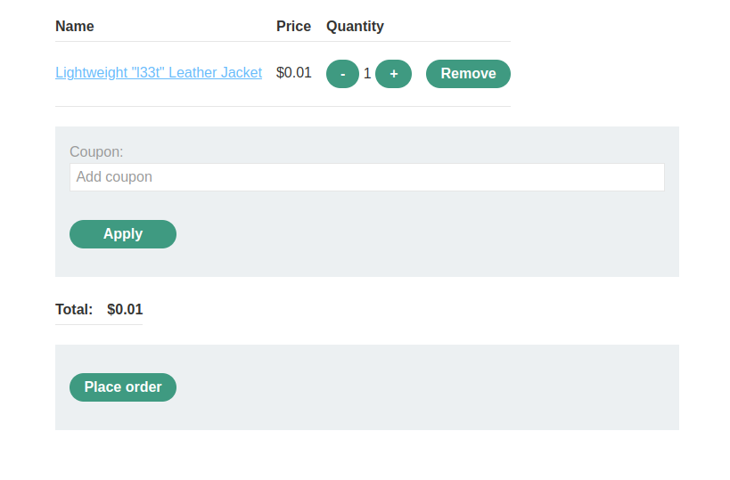
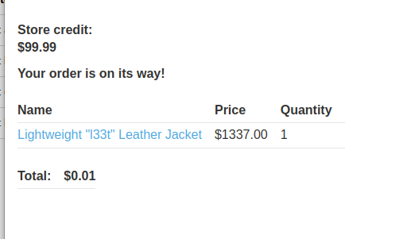

# Lab: Excessive trust in client-side controls

## Lab Description

This lab **doesn't adequately validate user input**. You can exploit a logic flaw in its **purchasing workflow to buy items for an unintended price**. To solve the lab, buy a "Lightweight l33t leather jacket".

You can log in to your own account using the following credentials: `wiener:peter`

## Lab Solution

**Lessons Learned**: If it is not possible to change to 0 value, change it to as minimal as possible.

We need to log in.

Despite it is not for free, it is almost free.
