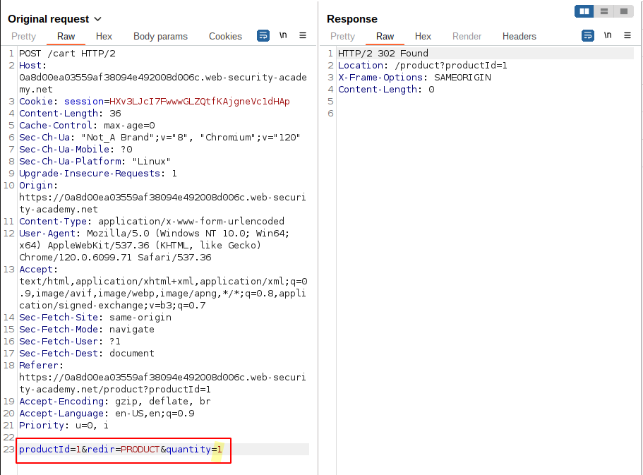
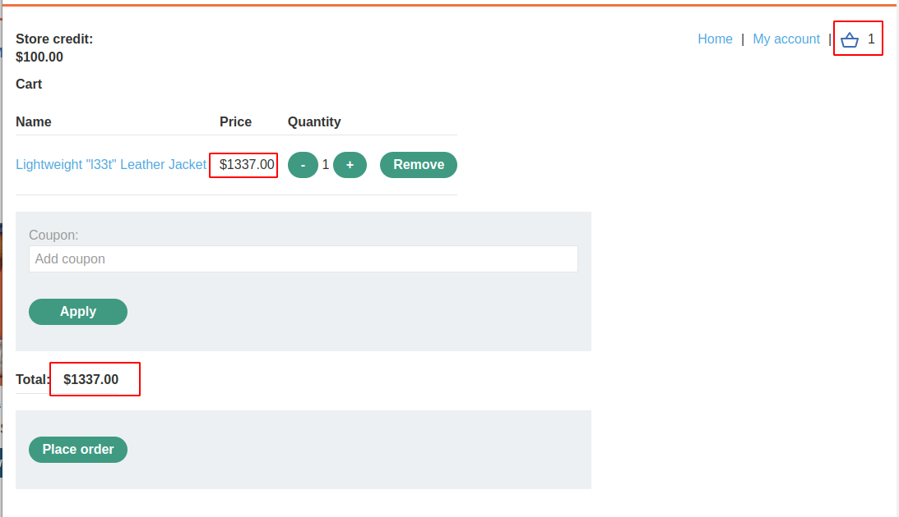
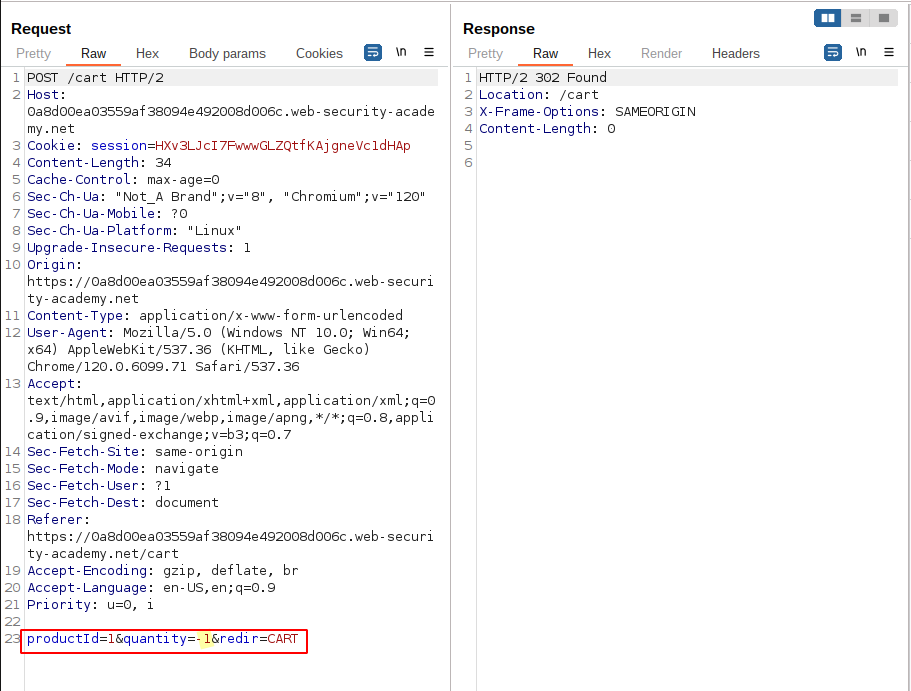
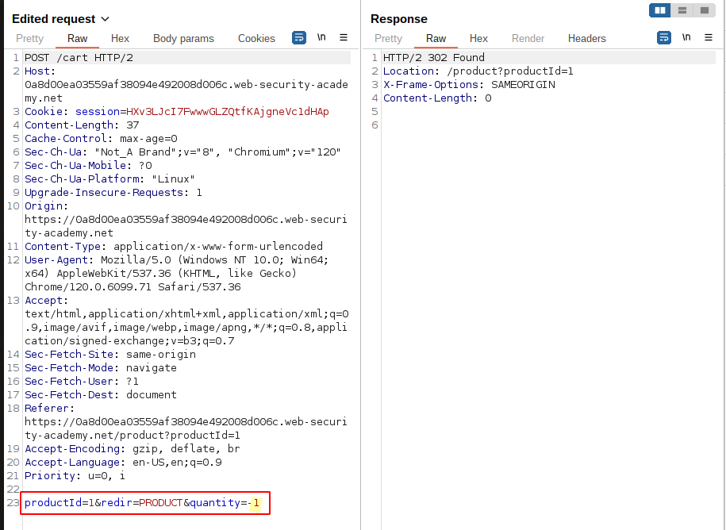
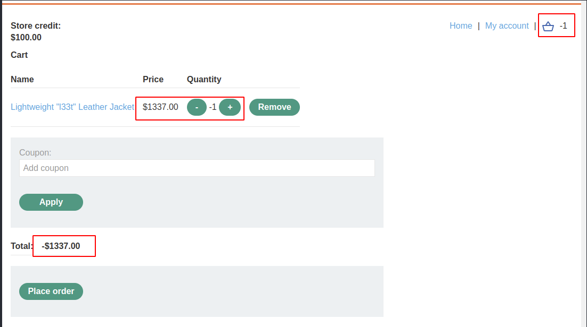
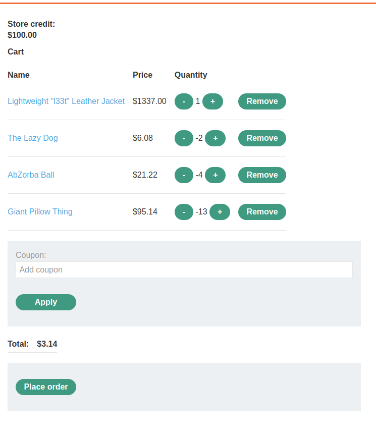
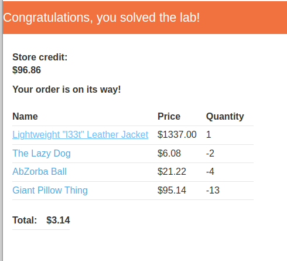

# Lab: High-level logic vulnerability

## Lab Description

This lab doesn't **adequately validate user input**. You can exploit a logic flaw in its **purchasing workflow to buy items for an unintended price**. To solve the lab, buy a "Lightweight l33t leather jacket".

You can log in to your own account using the following credentials: `wiener:peter`

## Lab Solution

**Lessons Learned**: Not possible to manipulate the price? No problem. Try to add negative amount of products. Maybe you will get discount.

Examine the workflow:
Adding items to cart

Removing items from cart

Is it possible to add a negative amount of the quantity to the cart?

Yes, it is. Add items which will minimize the price of jacket.

Order completed.

