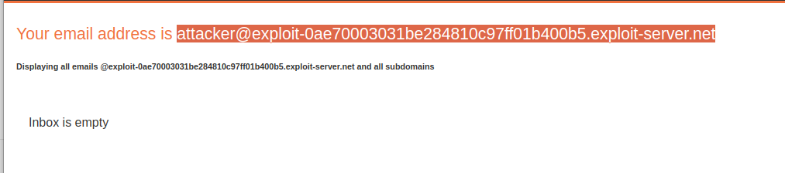

# Lab: Inconsistent security controls
## Lab Description

This lab's **flawed logic allows arbitrary users to access administrative functionality** that should only be available to company employees. To solve the lab, **access the admin panel and delete the user `carlos`**.

## Lab Solution

**Lessons Learned:** If there is a email verification before finishing registration, chceck if the application needs verification upon change. And how it will behave when having "internal" email address.

Lab shows us direction in the registration.

> If you work for DontWannaCry, please use your @dontwannacry.com email address

But we dont have access to that mailbox.

We will try new registration, with our own mail.

Now we got the verification and active acount.

Lets see what we can do as Francis.

Email change!

Once logged in, the server does not verify if we own the email address, and gives us access to employees privileges.

This way we can accomplish the mission.

