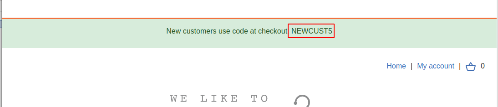
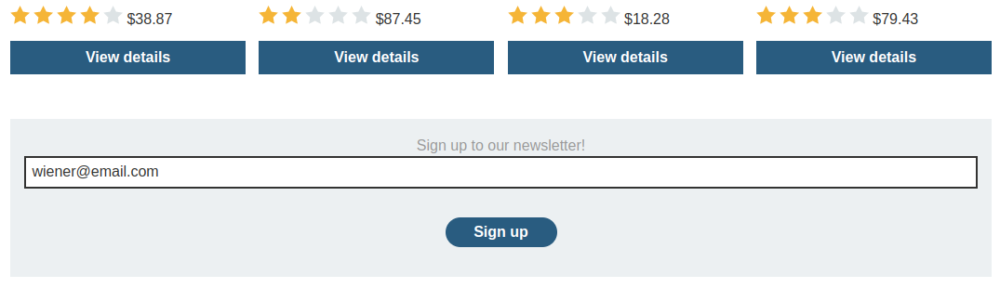
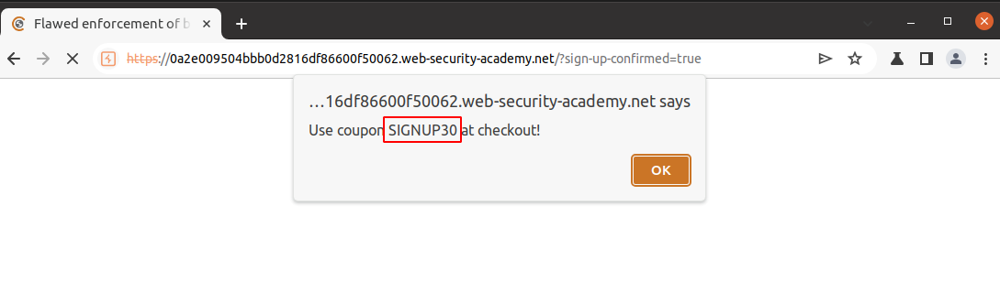
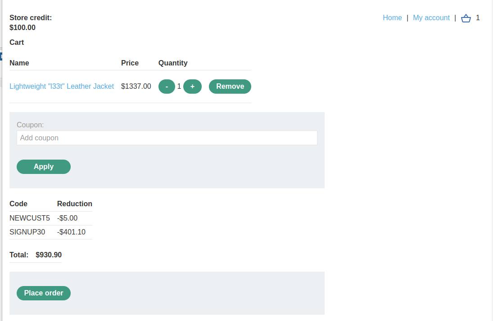
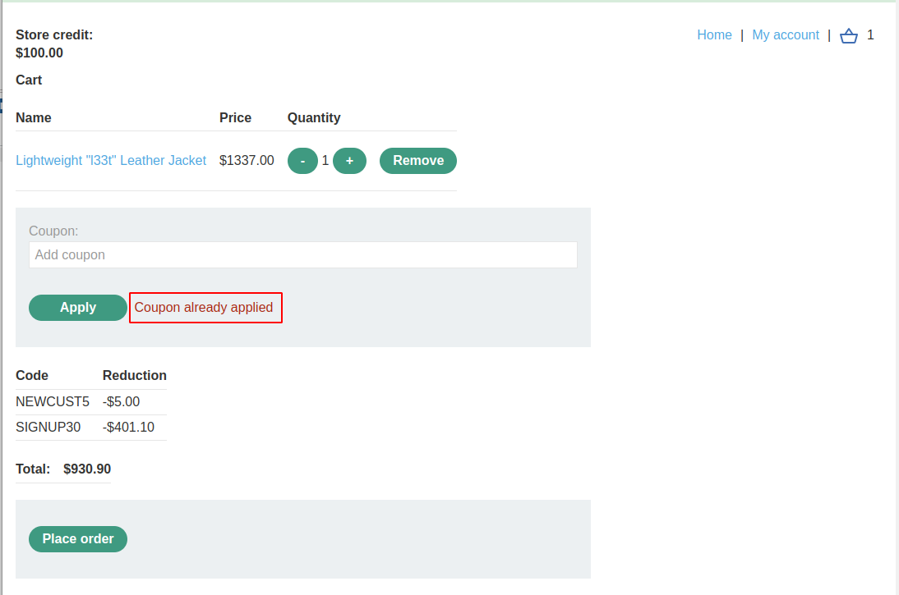
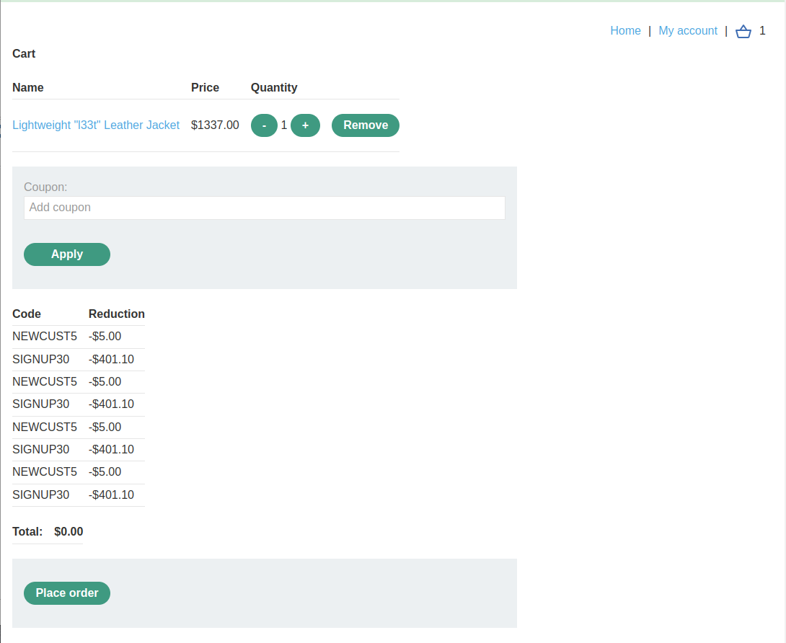
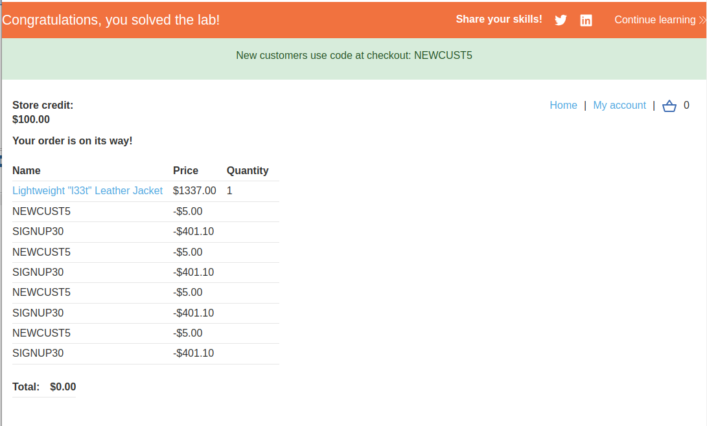

# Lab: Flawed enforcement of business rules

## Lab Description

This lab has a **logic flaw in its purchasing workflow**. To solve the lab, exploit this flaw to buy a "Lightweight l33t leather jacket".

You can log in to your own account using the following credentials: wiener:peter

## Lab Solution

**Lessons Learned**: Coupons are a vital part to focus on. In this example, the application ensures that the user does not apply the same coupon twice. It protected when the user tried it twice in a row but failed if two coupons were applied alternatively.

New customers use code at checkout: NEWCUST5

Use coupon SIGNUP30 at checkout!

If we tried to apply the same coupon, we will get the error that `coupon already applied`.

However, if we apply them alternating, first the `NEWCUTS5` coupon, then `SIGNUP30` and then again the `NEWCUTS5` coupon, then `SIGNUP30` and over and over, we can zero the price.

