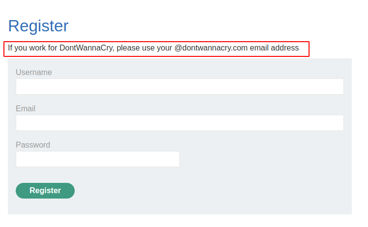

# Lab: Inconsistent handling of exceptional input

## Lab Description

This lab **doesn't adequately validate user input**. You can exploit a logic flaw in its **account registration process to gain access to administrative functionality**. To solve the lab, access the admin panel and **delete the user `carlos`**.

## Lab Solution

**Lessons Learned:**

**Check if and how the application works with long strings**. In some database systems like `MySQL`, the `VARCHAR` data type has a `maximum limit of 255 characters` for the column width.

Similarly, in specific programming languages or contexts, there might be limitations on the length of strings or variables for efficiency or legacy reasons.

**Truncated results can lead to bypasses**

Here we cannot change the email as we were able to do in lab [**Inconsistent security controls**](03-lab-Inconsistent-security-controls/03-lab.md)

The email got truncated .

After checking, we know that it was shortened to 255 characters. We can use this to satisfy the condition registering with `@dontwannacry.com` email, to gain access to administrative interface.

Important here is that our email server is **displaying all emails main email and all subdomains**.

