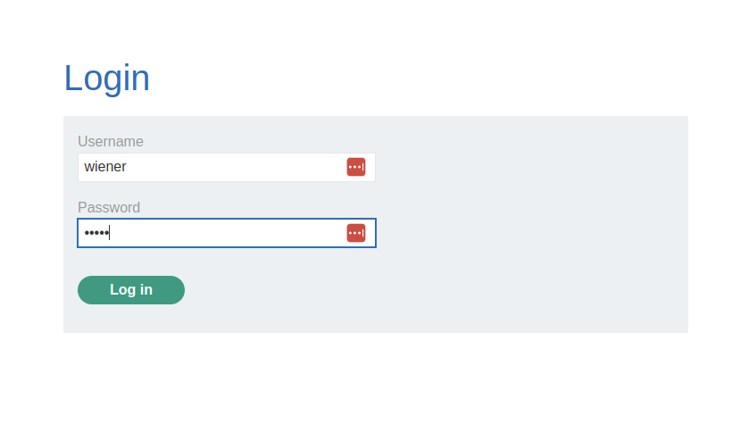
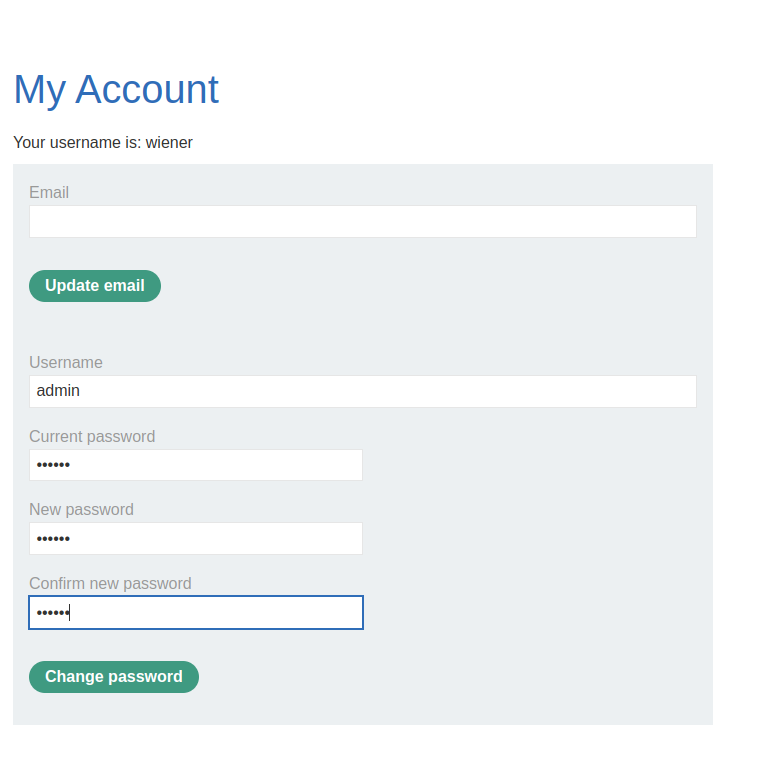
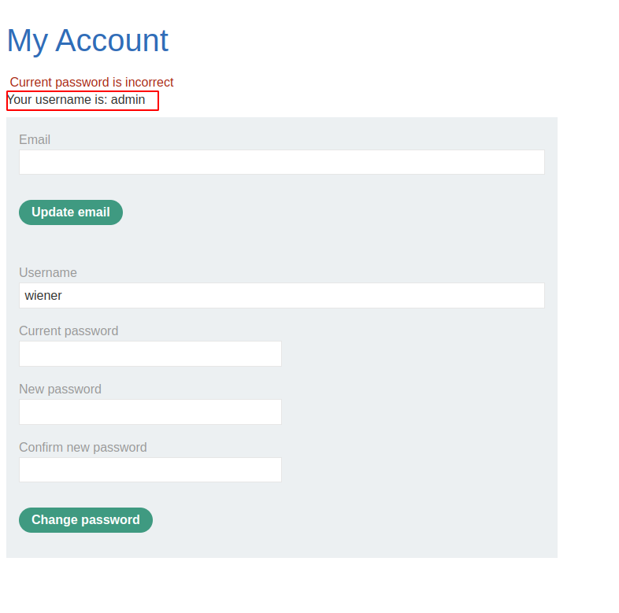
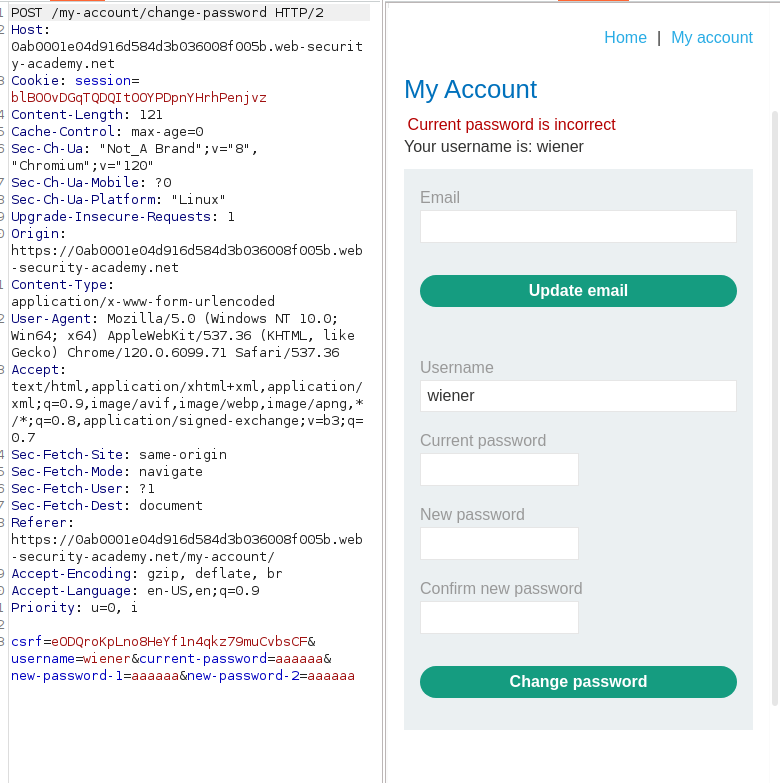
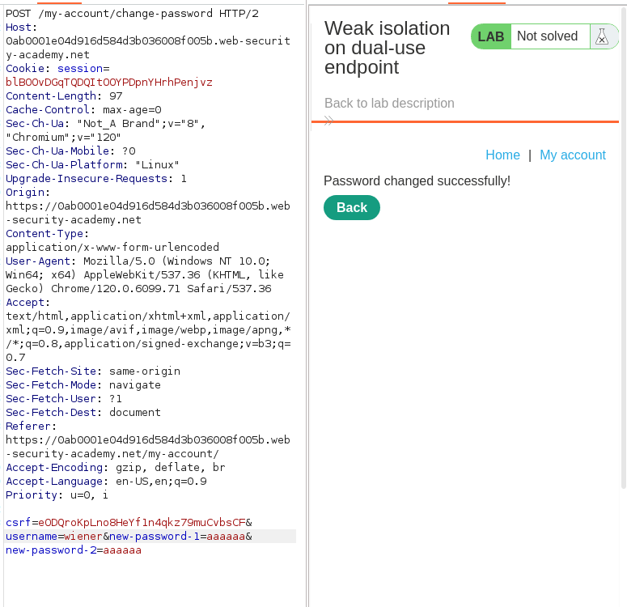
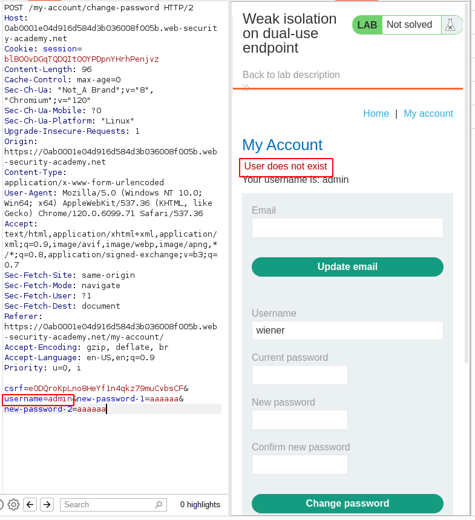
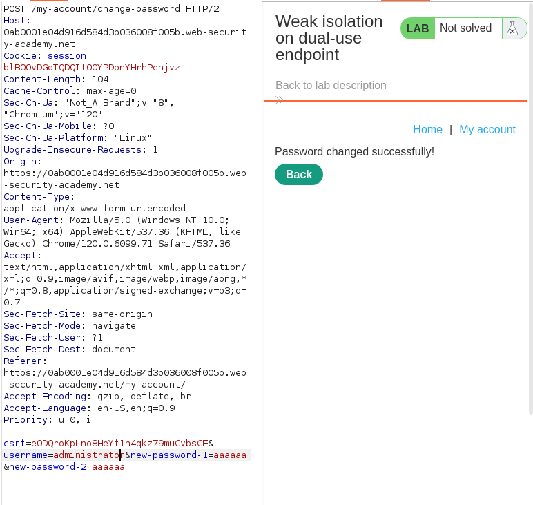
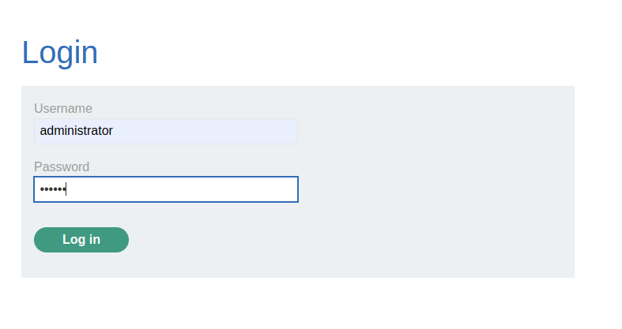
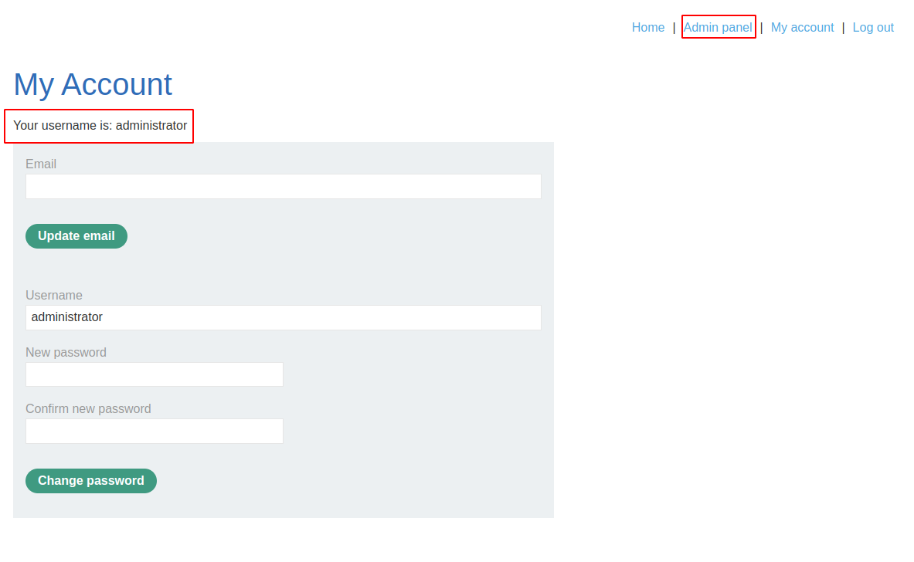
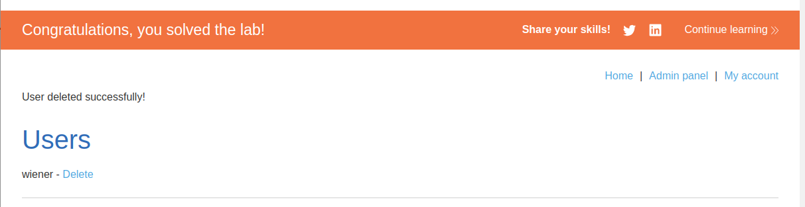

# Lab: Weak isolation on dual-use endpoint

## Lab Description

This lab makes a **flawed assumption about the user's privilege level based on their input**. As a result, you can exploit the logic of its **account management features to gain access to arbitrary users' accounts**. To solve the lab, **access the administrator account and delete the user `carlos`**.

You can log in to your own account using the following credentials: `wiener:peter`

## Lab Solution

**Lessons Learned:** Some endpoints can be used for multiple purposes, such as when a regular user and administrator (superuser) use the same change-password endpoint.

The administrator does not need to know the current password, nor do we do when we change the request.

Since we are supposed to get an administrator account, let's try to change the admin's password.

The password change is unsuccessful, yet we can observe that the page reflects the new username we supplied when we attempted the change.

Capture the request, pretending we don't know our current password.

We omit the `current-password` variable and submit the HTTP request.

Let's repeat the same process for the `admin` user. However, we find that the admin user does not exist.

We tried resetting the user `administrator`, but this time, it was successful.

So we can log in as `administrator`, access the administrator panel, and delete `carlos`.

