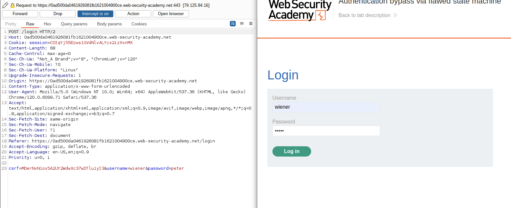

# Lab: Authentication bypass via flawed state machine

## Lab Description

This lab makes **flawed assumptions about the sequence of events in the login process**. To solve the lab, exploit this flaw to bypass the lab's authentication, access the admin interface, and delete the user `carlos`.

You can log in to your own account using the following credentials: `wiener:peter`

## Lab Solution

**Lessons Learned:** Sometimes, dropping a step in the sequential flow will get us in the right direction.

First, we log in to  Wiener's account with the provided credentials `wiener:peter` to see how the login process works.


After login, we are presented with the choice of whether to be a user or content author.


But what if we interrupt the flow by dropping the second request?




We can observe that despite using credentials for the `wiener` user, we got the role of `administrator` user.

Now we can access the `Admin panel` and delete the user `carlos`.


**What probably happened?**

If the page  `role-selector` does not load, the user is the administrator.

```
Start
|
|--> User Login
       |
       |--> Check User Role
       |       |
       |       |--> If Administrator
       |       |       |
       |       |       |--> Direct to Admin Dashboard
       |       |
       |       |--> If the Normal User
       |               |
       |               |--> Redirect to Role Selector
       |                       |
       |                       |--> User Chooses Role
       |                               |
       |                               |--> If the Content Creator
       |                               |       |
       |                               |       |--> Redirect to Content Creator Dashboard
       |                               |
       |                               |--> If Normal User
       |                                       |
       |                                       |--> Redirect to Normal User Dashboard
       |
       |--> End
```
