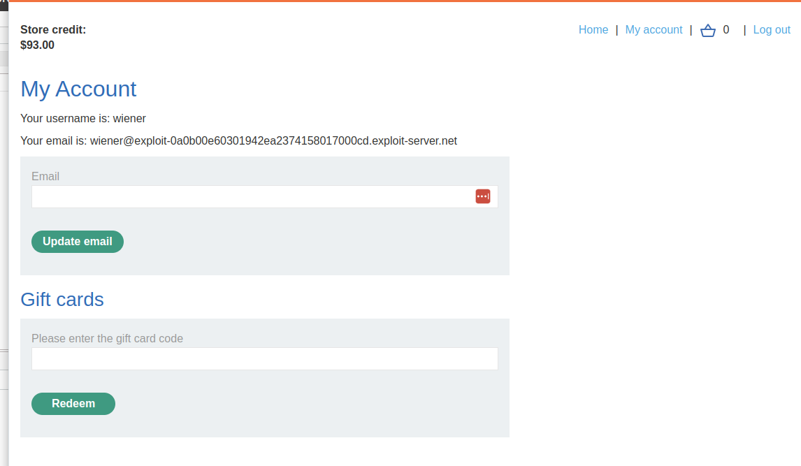
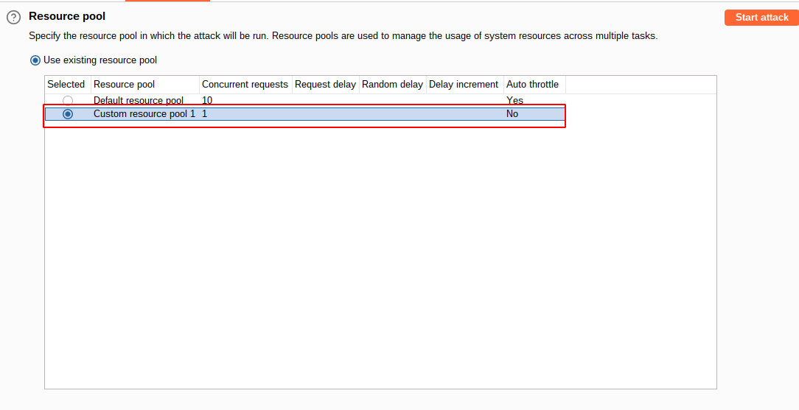

#Lab: Infinite money logic flaw

## Lab Description

This lab has a **logic flaw in its purchasing workflow**. To solve the lab, exploit this flaw to buy a `Lightweight l33t leather jacket`.

You can log in to your own account using the following credentials: `wiener:peter`

## Lab Solution

**Lessons Learned:**

**NOTE:** This exercise assumes infinite usage of the `SIGNUP30` coupon, once per order.

With Burp running, log in


and sign up for the newsletter


to obtain a coupon code, `SIGNUP30`.


Notice that you can buy $10 gift cards and redeem them from the `My account` page.

Add a gift card to your basket and proceed to the checkout.


Apply the coupon code to get a 30% discount. Complete the order and copy the gift card code to your clipboard.


Go to your account page and redeem the gift card. Observe that this entire process has added $3 to your store credit (I have $93, bcs I bought first one without discount.).




Now you need to try and automate this process.

Study the proxy history and notice that you redeem your gift card by supplying the code in the gift-card parameter of the `POST /gift-card` request.

```
POST /gift-card HTTP/2
Host: 0a95001804cab46680d8d5c900fe00fc.web-security-academy.net
....[SNIP]....
csrf=LpXPHJxmuj0WC1B4ZZTPYZhUuhDyPeM7&gift-card=fVfhXCj6qN
```

Go to `Project options` > `Sessions`. In the `Session handling rules` panel, click `Add`.


The `Session handling rule editor` dialog opens.
In the dialog, go to the `Scope` tab. Under `URL Scope`, select `Include all URLs`.


Go back to the `Details` tab. Under `Rule actions`, click `Add` > `Run a macro`.


Under `Select macro`, click `Add` again to open the Macro Recorder.

Select the following sequence of requests:
```
POST /cart
POST /cart/coupon
POST /cart/checkout
GET /cart/order-confirmation?order-confirmed=true
POST /gift-card
```


Then, click `OK`. The Macro Editor opens.

In the list of requests, select `GET /cart/order-confirmation?order-confirmed=true`. Click `Configure item`.


In the dialog that opens, click `Add` to create a custom parameter.


Name the parameter gift-card and highlight the gift card code at the bottom of the response.


Click `OK` twice to go back to the Macro Editor.

Select the `POST /gift-card` request and click `Configure item` again.


In the `Parameter handling` section, use the drop-down menus to specify that the gift-card parameter should be derived from the prior response (response 4).


Click `OK`.

In the Macro Editor, click `Test macro`. Look at the response to `GET /cart/order-confirmation?order-confirmation=true` and note the gift card code that was generated. Look at the `POST /gift-card` request. Make sure that the gift-card parameter matches and confirm that it received a 302 response. Keep clicking `OK` until you get back to the main Burp window.


Send the `GET /my-account` request to Burp Intruder. Use the `Sniper` attack type.


On the `Payloads` tab, select the payload type `Null payloads`. Under `Payload settings`, choose to generate `412 payloads` (($1337-$100)/$3=412.3).


Go to the `Resource pool` tab and add the attack to a resource pool with the `Maximum concurrent requests` set to 1. Start the attack.



We can observe that macro is working, and money is increasing in the account.


After finishing `412` payloads, we have enough credit to buy the leather `l33t` jacket.


Add item to the cart, and order.


