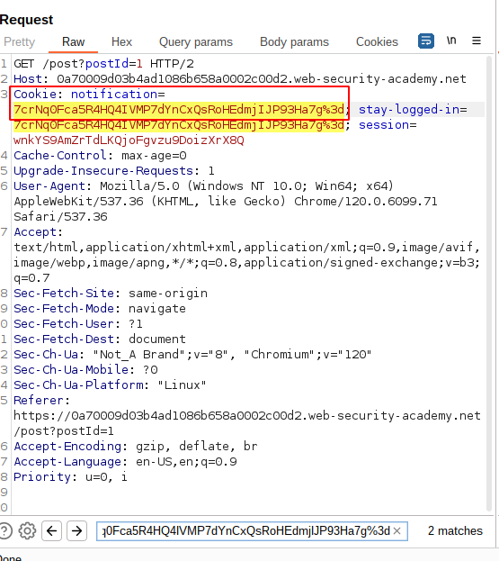

# Lab: Authentication bypass via encryption oracle

## Lab Description

This lab contains **a logic flaw that exposes an encryption oracle** to users. To solve the lab, **exploit this flaw to gain access to the admin panel and delete the user `carlos`**.

You can log in to your own account using the following credentials: `wiener:peter`.

## Lab Solution

**Lessons Learned**: The application may reuse the identical encryption mechanism for multiple features. If, at some point, the messages are decrypted and reflected, try all other cookies and encrypted parameters to see if it is possible to decrypt.

NOTE: Pictures are from two sessions, so they will not look the same, but the logic follows.

Log in with the `"Stay logged in"` option enabled


and post a comment.


Study the corresponding requests and responses in `Proxy` tab under `HTTP history`. Observe that the `stay-logged-in cookie` is encrypted.

**HTTP POST Request**
```
POST /post/comment HTTP/2
Host: 0a70009d03b4ad1086b658a0002c00d2.web-security-academy.net
Cookie: stay-logged-in=7crNq0Fca5R4HQ4IVMP7dYnCxQsRoHEdmjIJP93Ha7g%3d; session=wnkYS9AmZrTdLKQjoFgvzu9DoizXrX8Q

...[SNIP]...

csrf=TFrMxOfJVI03JZMNZqEXS15vL3xrETf5&postId=1&comment=Simple+comment&name=francis&email=francis%40dontwannacry.com&website=
```

**HTTP POST Response**

```
HTTP/2 302 Found
Location: /post/comment/confirmation?postId=1
X-Frame-Options: SAMEORIGIN
Content-Length: 0
```

Now, submit the comment with the incorrect email address.


Notice that when you try to submit a comment using an invalid email address, the response sets an encrypted notification cookie before redirecting you to the blog post.

**HTTP POST Request**
```
POST /post/comment HTTP/2
Host: 0a70009d03b4ad1086b658a0002c00d2.web-security-academy.net
Cookie: stay-logged-in=7crNq0Fca5R4HQ4IVMP7dYnCxQsRoHEdmjIJP93Ha7g%3d; session=wnkYS9AmZrTdLKQjoFgvzu9DoizXrX8Q
...[SNIP]...

csrf=TFrMxOfJVI03JZMNZqEXS15vL3xrETf5&postId=1&comment=invalid+comment&name=francis&email=francis.dontwannacry.com&website=
```

**HTTP POST Response**
```
HTTP/2 302 Found
Location: /post?postId=1
Set-Cookie: notification=I84659k6jbtEDIW7GxsA4%2f08xsP8ydKQ%2fdQFPyHpfX1PDsKEYRyWLq%2b6i9vyZQVi; HttpOnly
X-Frame-Options: SAMEORIGIN
Content-Length: 0
```

Furthermore, the redirected page shows the error message reflects your input from the email parameter in `cleartext`:

`Invalid email address: francis.dontwannacry.com`


Deduce that this must be **decrypted** from the `notification cookie`.

Send the `POST /post/comment` and the subsequent `GET /post?postId=1` request (containing the notification cookie) to Burp Repeater to create an `encryptor` and `decryptor` mechanism.

This way, you can use the `email parameter` of the `POST request` to `encrypt` arbitrary data and reflect the corresponding `ciphertext` in the `Set-Cookie: notification= ` header. Likewise, you can use the `notification cookie` in the `GET request` to `decrypt` arbitrary `ciphertext` and reflect the output in the error message.

Let's copy the `stay-logged-in cookie` and paste it into the `notification cookie` to see if the decryption mechanism is the same as for other functions.




Send the request. Instead of the error message, the response now contains the decrypted `stay-logged-in cookie`.


This reveals that both functions use the same decryption mechanism, and the cookie should be in the `username:timestamp`.

Go to the encrypt request and change the email parameter to `administrator:your-timestamp` (atm, `administrator:1705058922061`).


Send the request and then copy the new notification cookie from the response.


Decrypt this new cookie and observe that the 23-character `"Invalid email address: "` prefix is automatically added to any value you pass using the email parameter.


Send the notification cookie to Burp Decoder.
In `Decoder`, `URL-decode` and `Base64-decode` the cookie.
In Burp Repeater, switch to the message editor's "Hex" tab. Select the first 23 bytes, then right-click and select `Delete selected bytes`.


Re-encode the data and copy the result into the notification cookie of the decrypt request.


When you send the request, observe that an error message indicates that a block-based encryption algorithm is used and that the `input length must be a multiple of 16.`


You need to pad the `"Invalid email address: "` prefix with enough bytes so that the number of bytes you will remove is a multiple of 16, meaning we need to add 9 characters to the start of the intended cookie value.

`xxxxxxxxxadministrator:your-timestamp` (atm, `administrator:1705058922061`)
Encrypt this input.


Use the decrypt request to test that it can be successfully decrypted.


Send the new ciphertext to `Decoder`, then `URL` and `Base64-decode` it. This time, delete 32 bytes from the start of the data.


Re-encode the data and paste it into the notification parameter in the decrypt request.


Check the response to confirm that your input was successfully decrypted and no longer contains the `"Invalid email address: " ` prefix. You should only see `administrator:your-timestamp`.


Turn on `Intercept` and load the page. Remove the `notification` and `session` cookie and replace value of `stay-logged-in` cookie with the newly crafted ciphertext. And forward the request to the server.


Now we gained access to the `Admin panel`.


Access the `Admin panel`.


And delete user `carlos.`


