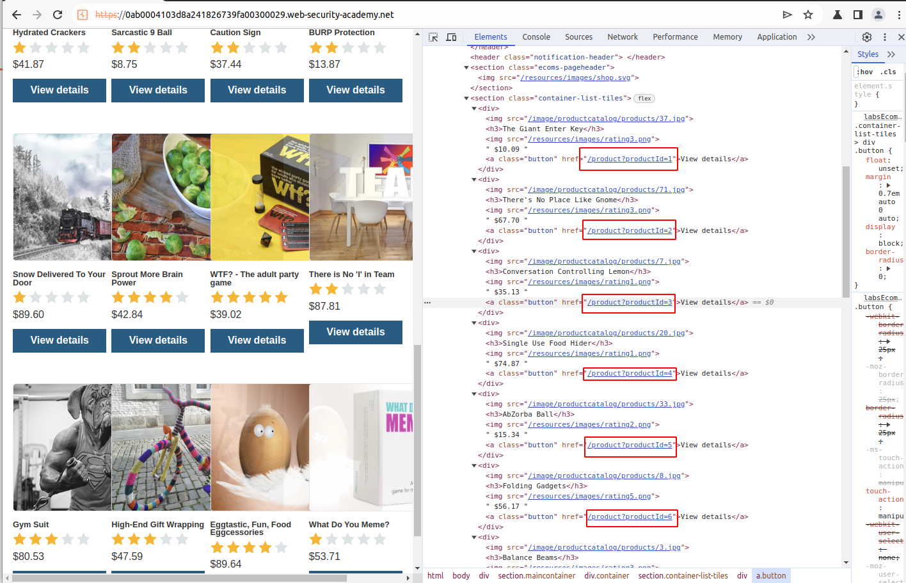
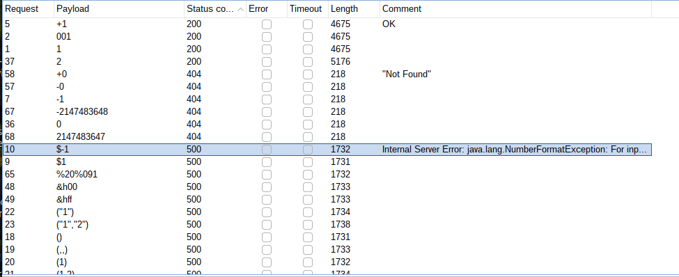

# Lab: Information-disclosure-in-error-messages

## Lab Description

This lab's verbose error messages reveal that it is using a vulnerable version of a third-party framework. To solve the lab, obtain and submit the version number of this framework.

## Lab Solution

**Lesson Learned:** Always try different data-types to each entry point.




```
Internal Server Error: java.lang.NumberFormatException: For input string: "string"
	at java.base/java.lang.NumberFormatException.forInputString(NumberFormatException.java:67)
	at java.base/java.lang.Integer.parseInt(Integer.java:654)
	at java.base/java.lang.Integer.parseInt(Integer.java:786)
	at lab.p.w.x.b.t(Unknown Source)
	at lab.x.f.s.r.l(Unknown Source)
	at lab.x.f.t.w.w.R(Unknown Source)
	at lab.x.f.t.t.lambda$handleSubRequest$0(Unknown Source)
	at l.t.o.o.lambda$null$3(Unknown Source)
	at l.t.o.o.J(Unknown Source)
	at l.t.o.o.lambda$uncheckedFunction$4(Unknown Source)
	at java.base/java.util.Optional.map(Optional.java:260)
	at lab.x.f.t.t.y(Unknown Source)
	at lab.server.j.a.n.u(Unknown Source)
	at lab.x.f.q.d(Unknown Source)
	at lab.x.f.q.u(Unknown Source)
	at lab.server.j.a.u.e.o(Unknown Source)
	at lab.server.j.a.u.r.lambda$handle$0(Unknown Source)
	at lab.p.n.l.a.b(Unknown Source)
	at lab.server.j.a.u.r.k(Unknown Source)
	at lab.server.j.a.y.W(Unknown Source)
	at l.t.o.o.lambda$null$3(Unknown Source)
	at l.t.o.o.J(Unknown Source)
	at l.t.o.o.lambda$uncheckedFunction$4(Unknown Source)
	at lab.server.m.c(Unknown Source)
	at lab.server.j.a.y.M(Unknown Source)
	at lab.server.j.u.y.K(Unknown Source)
	at lab.server.j.p.g(Unknown Source)
	at lab.server.j.h.g(Unknown Source)
	at lab.server.g.A(Unknown Source)
	at lab.server.g.Z(Unknown Source)
	at lab.o.s.lambda$consume$0(Unknown Source)
	at java.base/java.util.concurrent.ThreadPoolExecutor.runWorker(ThreadPoolExecutor.java:1136)
	at java.base/java.util.concurrent.ThreadPoolExecutor$Worker.run(ThreadPoolExecutor.java:635)
	at java.base/java.lang.Thread.run(Thread.java:833)

Apache Struts 2 2.3.31
```




NumberFormatException is thrown when it is not possible to convert a string to a numeric type (e.g. int, float),because of the format of an input string is illegal and not appropriate.

https://docs.oracle.com/javase/8/docs/api/java/lang/NumberFormatException.html
