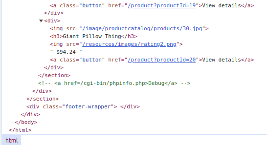
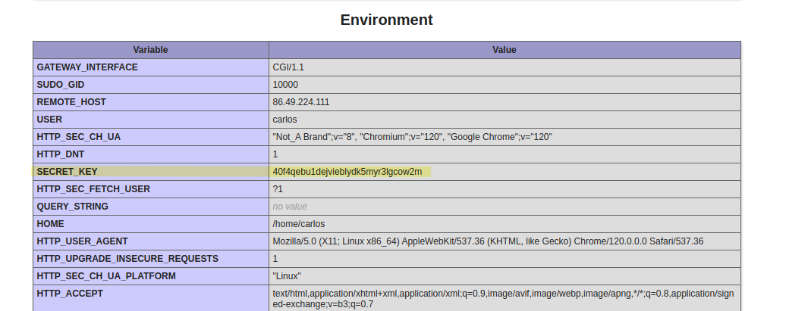

# Lab: Information disclosure on debug page

## Lab Description

This lab contains a debug page that discloses sensitive information about the application. To solve the lab, **obtain and submit the `SECRET_KEY` environment variable**.

## Lab Solution

**Lesson Learned:** Comments can expose confidential information and endpoints.

