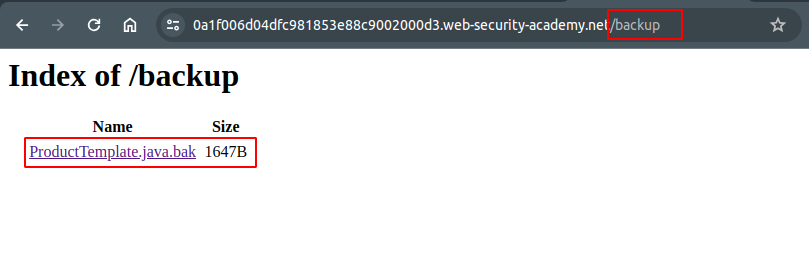
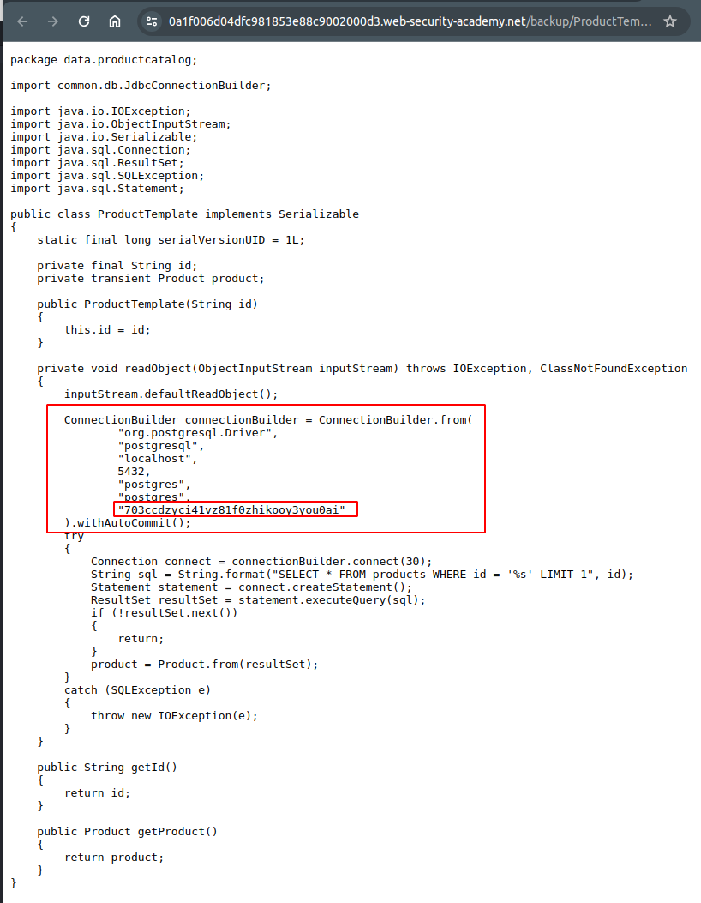

# Source code disclosure via backup files
## Lab Description

This lab leaks its source code via backup files in a hidden directory. To solve the lab, identify and submit the database password, which is hard-coded in the leaked source code.

## Lab Solution

**Lesson Learned**: It is quite common for developers to have some backup online. At some cases it is in path (`/backup`, `/backup.7z`), sometimes it is subdomain (`backup.example.com`).

And sometimes, it is hidden in the with more words or random gibberish such as `emailbackup`, `ownbackup-com` or `mobile-backup-58974156489413`.

Note: Each framework/cms/technology may have its own **default** path where the backup is stored.

