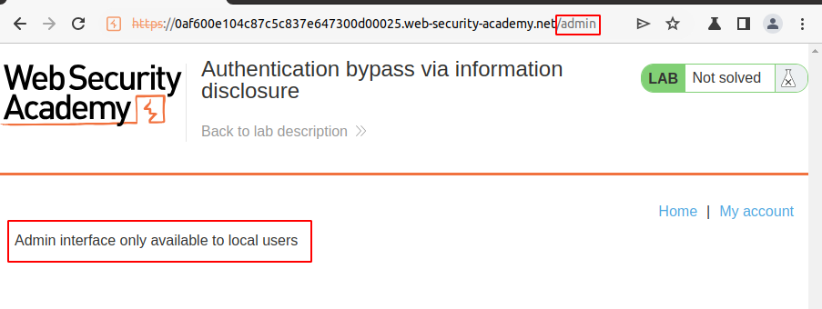
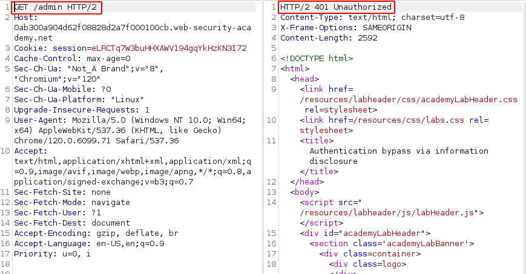
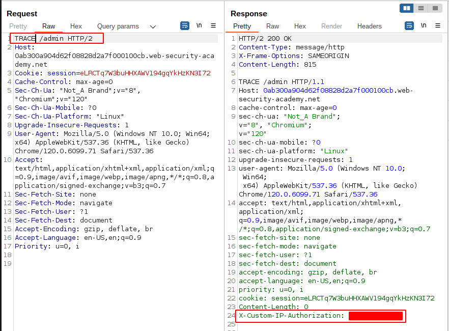
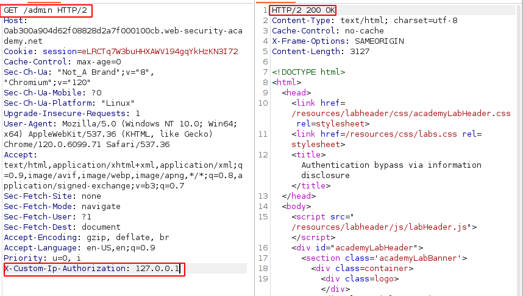
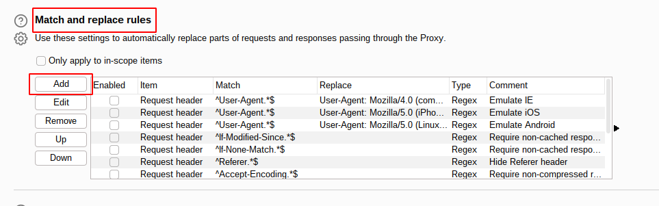
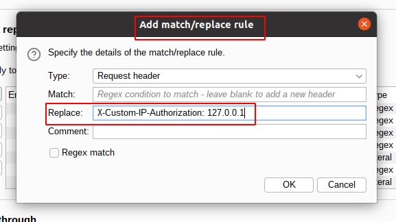
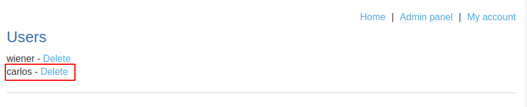
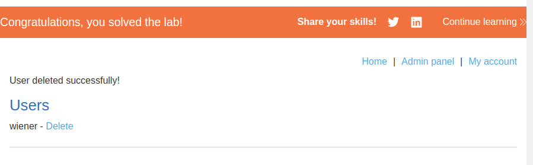

# Lab: Authentication bypass via information disclosure
## Lab Description

This lab's **administration interface** has an authentication bypass vulnerability, but it is impractical to exploit without knowledge of a custom HTTP header used by the front-end.

To solve the lab, obtain the **header name then use it to bypass the lab's authentication**. Access the admin interface and delete the user `carlos`.

You can log in to your own account using the following credentials: `wiener:peter`

## Lab Solution

**Lesson Learned:** **HTTP TRACE method** may show **CUSTOM HEADERS**, which company created for their protection, or which are added by proxies.

```
X-Forwarded-For: EXAMPLE_IP, EXAMPLE_IP
ANOTHER_CUSTOM_HTTP_HEADER: VALUE
X-Custom-IP-Authorization: VALUE
```

When **custom header** is found add new rule in Proxy settings, to insert header automatically to each request.

NOTE: **NEVER DELETE USERS YOU DO NOT OWN, OR YOU ARE NOT EXPLICITLY PERMITTED TO DELETE**

In this case login credentials for our own account was misleading information, because it was not needed.

















P.S: https://twitter.com/albinowax/status/1587800171051503617?lang=en

Link to: https://portswigger.net/web-security/host-header/exploiting/lab-host-header-authentication-bypass
