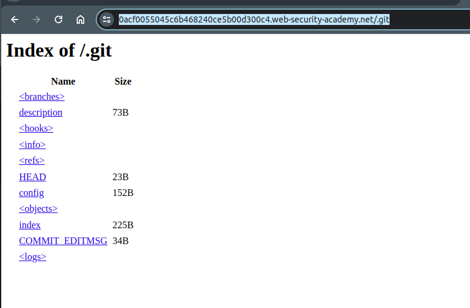
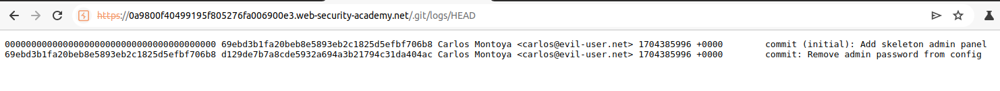
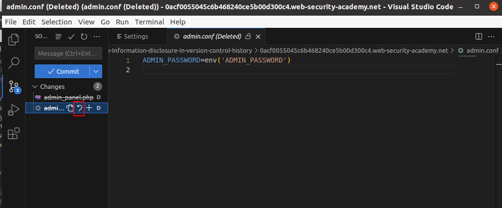
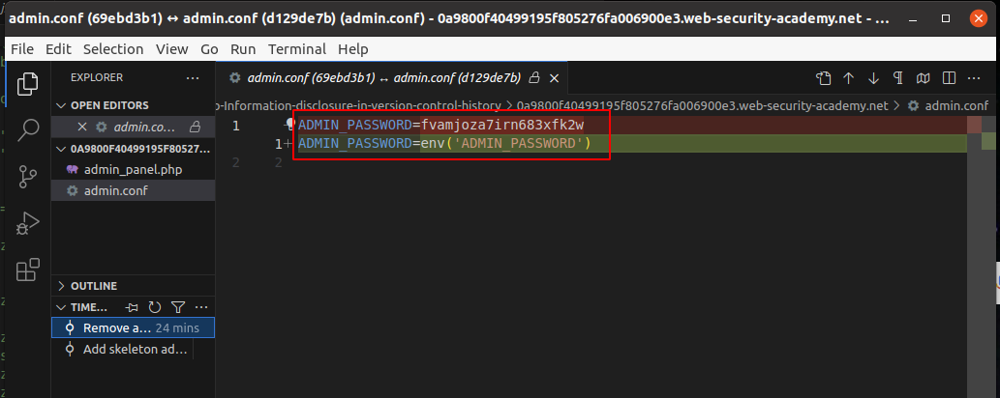
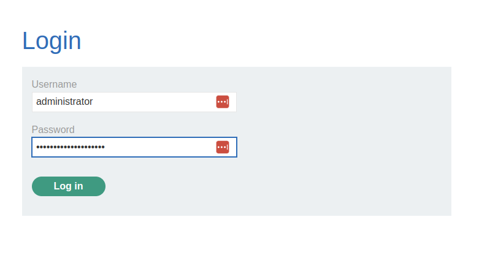

# Lab: Information disclosure in version control history
## Lab Description

This lab discloses **sensitive information via its version control history**. To solve the lab, **obtain the password for the `administrator` user then log in and delete the user `carlos`.**

## Lab Solution

**Lessons Leaned:**
When you find `.git` directory at the web page, download it locally and examine it in software which can work with git repose, such as [Visual Studio Code](https://code.visualstudio.com/), [Git Cola](https://git-cola.github.io/downloads.html), [SmartGit](https://www.techspot.com/downloads/6070-smartgit.html) or whichever helps to see the diffs.

NOTE: **NEVER DELETE USERS YOU DO NOT OWN, OR YOU ARE NOT EXPLICITLY PERMITTED TO DELETE**

`wget -r https://0acf0055045c6b468240ce5b00d300c4.web-security-academy.net/.git`

