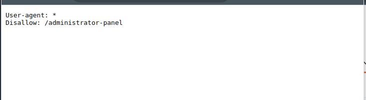
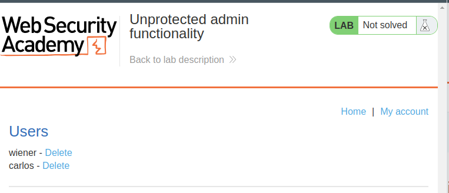
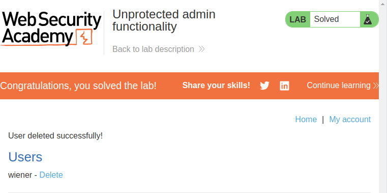

# Lab: Unprotected admin functionality

## Lab Description
Unprotected admin functionality

This lab has an unprotected admin panel.

Solve the lab by deleting the user `carlos`.

## Lab Solution
1. Go to the lab and view robots.txt by appending /robots.txt to the lab URL.Notice that the Disallow line discloses the path to the admin panel.

2. In the URL bar, replace /robots.txt with /administrator-panel to load the admin panel.

3. Delete `carlos`.

