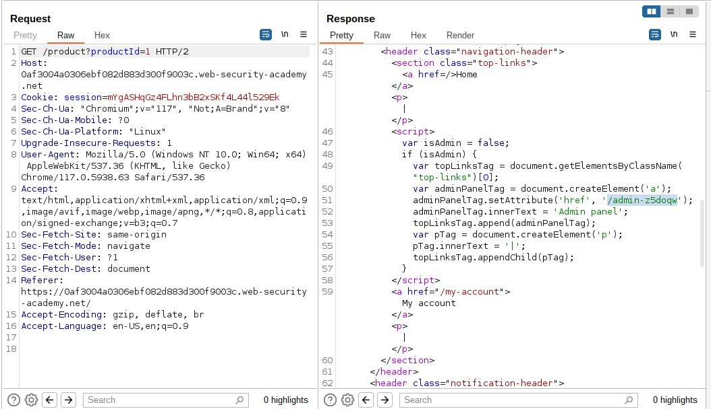
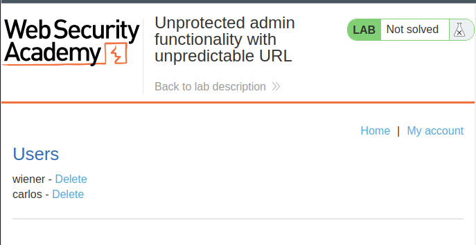
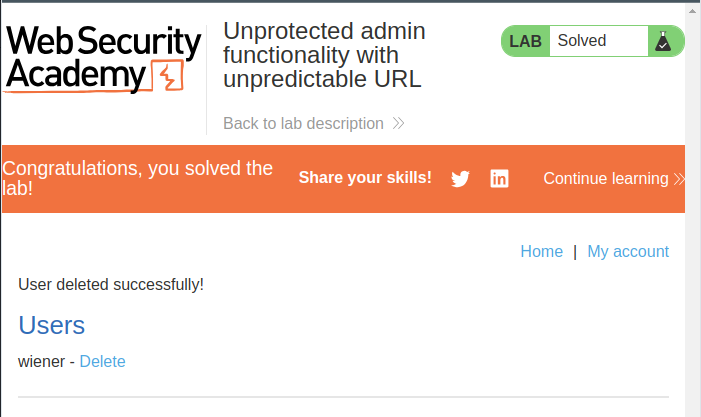

# Lab: Unprotected admin functionality with unpredictable URL

## Lab Description
This lab has an unprotected admin panel. It's located at an unpredictable location, but the location is disclosed somewhere in the application.

Solve the lab by accessing the admin panel, and using it to delete the user `carlos`.

## Lab Solution
1. Review the lab home page's source using Burp Suite or your web browser's developer tools.
2. Observe that it contains some JavaScript that discloses the URL of the admin panel.

3. Load the admin panel.

4. Delete `carlos`.

