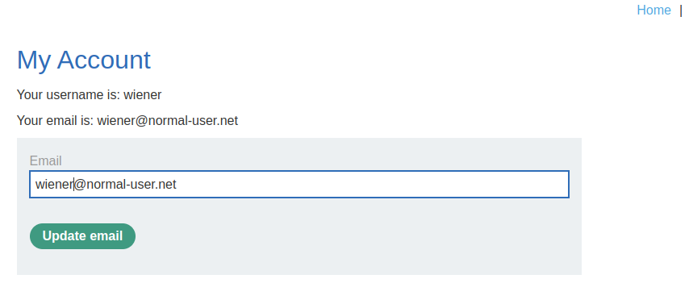
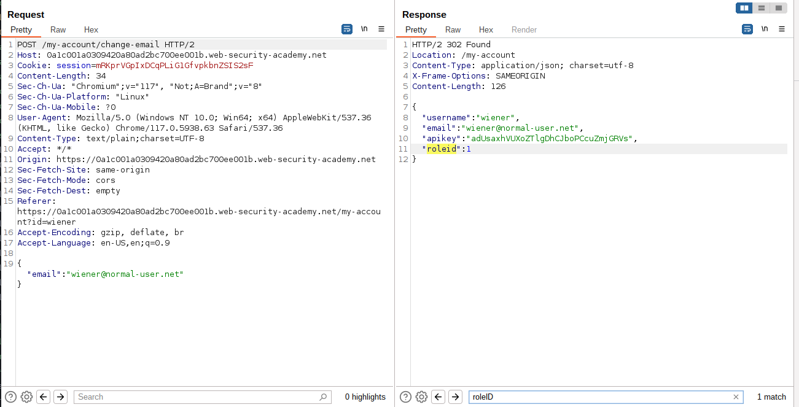
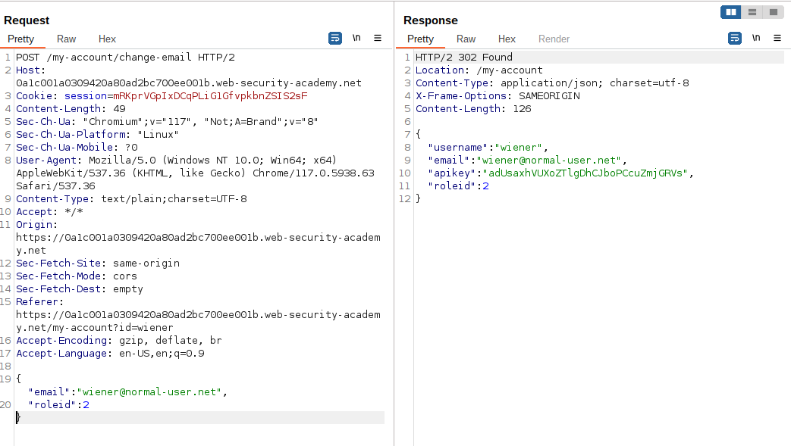
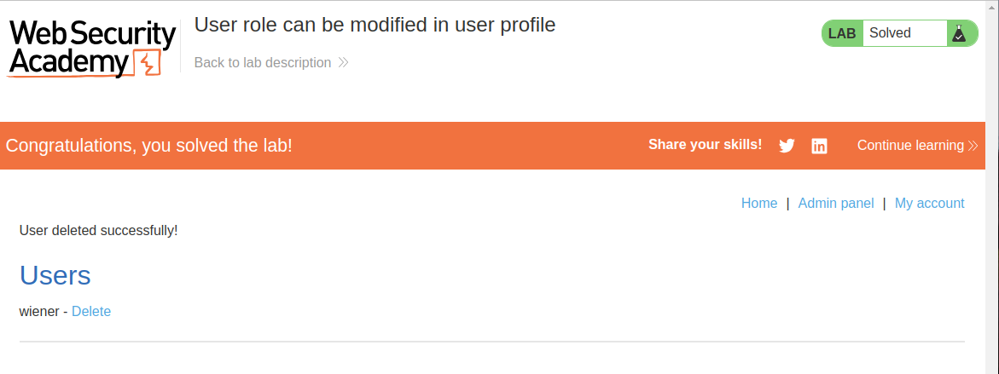

# Lab Description

This lab has an admin panel at `/admin`. It's only accessible to logged-in users with a `roleid` of `2`.

Solve the lab by accessing the admin panel and using it to delete the user `carlos`.

You can log in to your own account using the following credentials: `wiener:peter`

# Lab Solution

1. Log in using the supplied credentials and access your account page.

2. Use the provided feature to update the email address associated with your account.

3. Observe that the response contains your `role ID`.

4. Send the email submission request to Burp Repeater, add `"roleid":2` into the JSON in the request body, and resend it. Observe that the response shows your `roleid` has changed to 2.

5. Browse to `/admin` and delete `carlos`.

