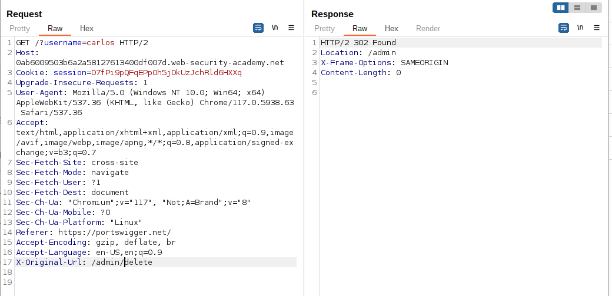

# Lab Description

This website has an unauthenticated admin panel at `/admin`, but a **front-end system has been configured to block external access to that path**. However, the back-end application is built on a framework that supports the `X-Original-URL` header.

To solve the lab, access the admin panel and delete the user `carlos`.

# Lab Solution

1. Try to load `/admin` and observe that you get blocked. Notice that the response is very plain, suggesting it may originate from a front-end system.
2. Send the request to Burp Repeater. Change the URL in the request line to `/` and add the HTTP header `X-Original-URL: /invalid`. Observe that the application returns a `"not found"` response. This indicates that the back-end system is processing the URL from the `X-Original-URL` header.
3. Change the value of the `X-Original-URL` header to `/admin`. Observe that you can now access the admin page.
4. To delete `carlos`, add `?username=carlos` to the real query string, and change the `X-Original-URL` path to `/admin/delete`.

**Question: How do I know if it is front end or back end blocking access to the admin panel?**

**In BurpSuite**

1. **Proxy History**: Check the Proxy history in Burp Suite after attempting to access the `/admin` path. Look at the details of the request and response. If the access is blocked by the front end, you might see a response from the front-end system indicating that access is denied.

2. **Target Site Map**: In Burp Suite, the Target site map provides a higher-level overview of the site's structure. Look for any entries related to the `/admin` path and check if there are specific responses or blocks. if the request to the `/admin` path is not getting recorded in the `Target Site Map` in `Burp Suite`, it might suggest that the blocking is happening before the request reaches the application server. This could be indicative of front-end blocking.
