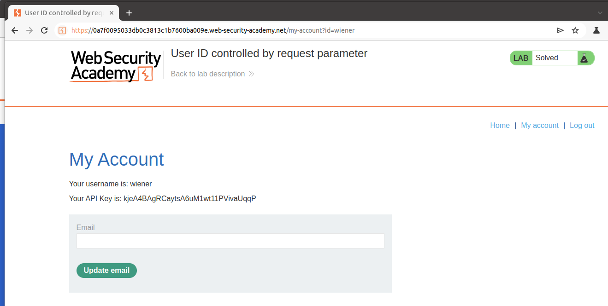
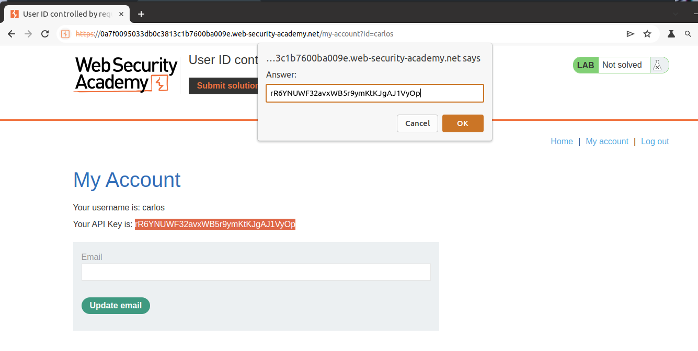

# Lab: User ID controlled by request parameter

## Lab Description

This lab has a **horizontal privilege escalation** vulnerability on the user account page.

To solve the lab, obtain the `API key` for the user `carlos` and submit it as the solution.

You can log in to your own account using the following credentials: `wiener:peter`

## Lab Solution

**Horizontal privilege escalation** involves gaining access to the rights of another account—human or machine—with **similar privileges**.

Note: The `id` value does not need to be numerical. In the example case `id=username`

1. Log in using the supplied credentials and go to your account page.

2. Note that the URL contains your username in the `"id"` parameter.

3. Change the "id" parameter to `carlos`.

4. Retrieve and submit the API key for `carlos`.

