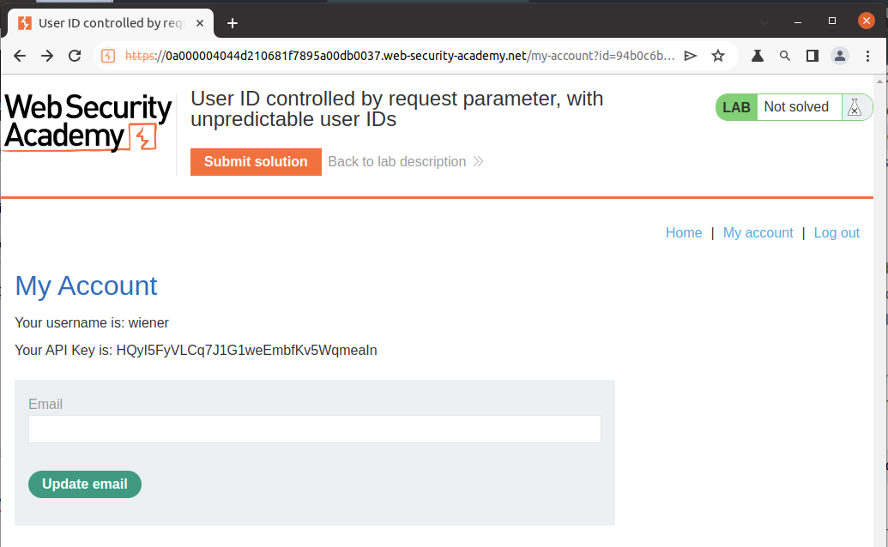
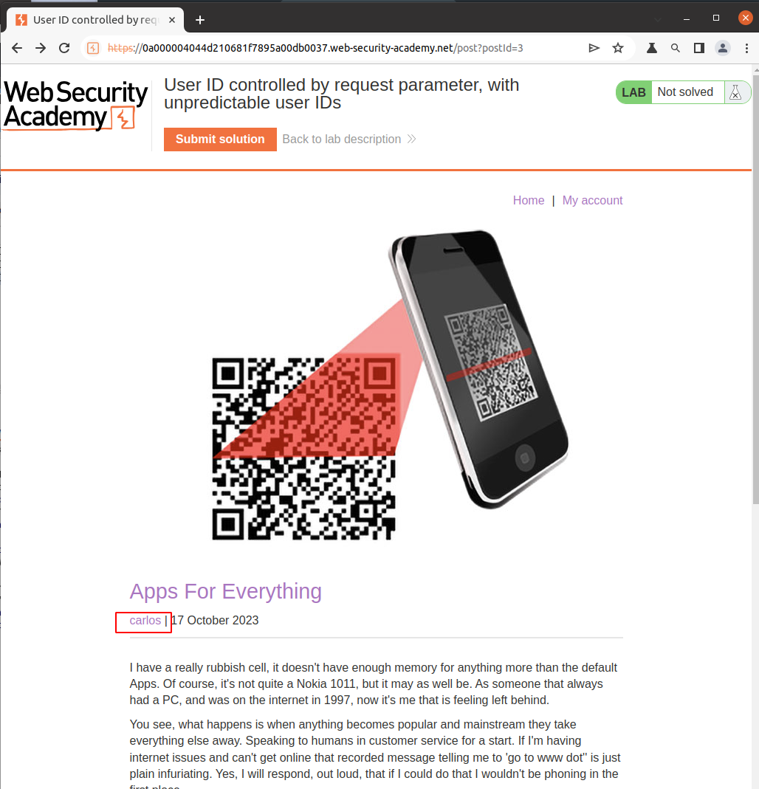
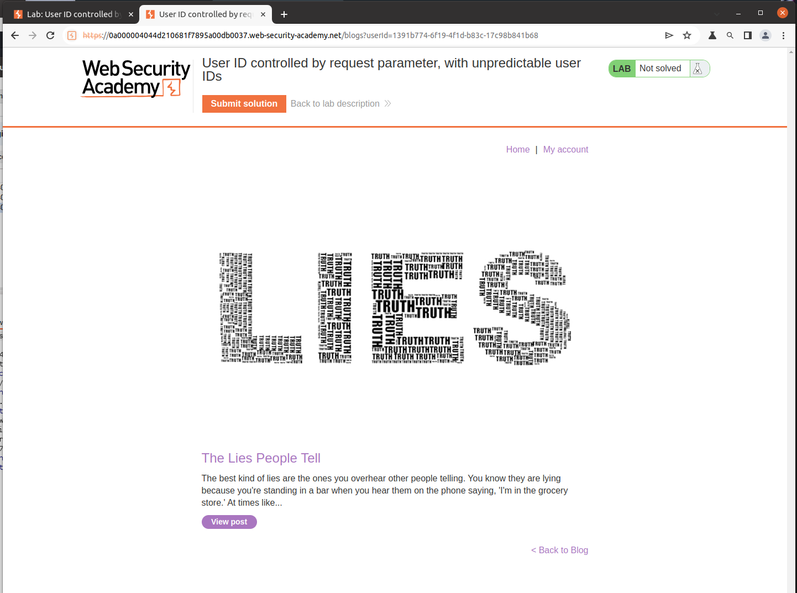
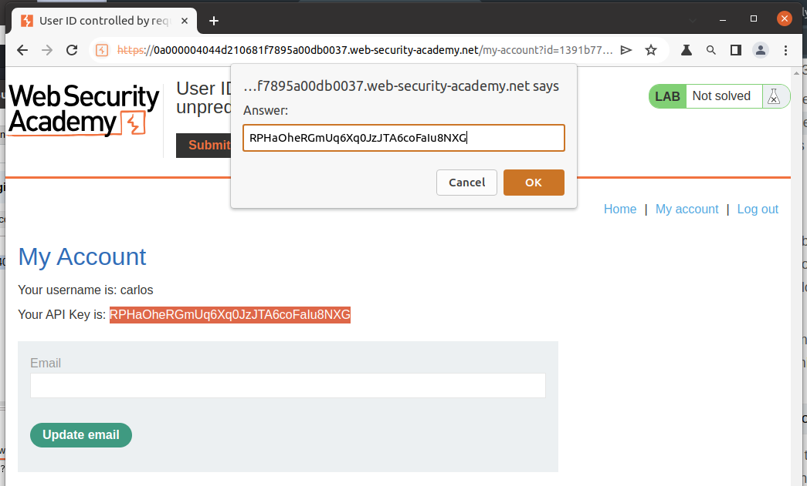

# Lab Description

This lab has a horizontal privilege escalation vulnerability on the user account page, but identifies users with `GUIDs`.

To solve the lab, find the `GUID` for `carlos`, then submit his `API key` as the solution.

You can log in to your own account using the following credentials: `wiener:peter`

# Lab Solution

1. Log in `wiener` account and observe the form of the `id` parameter `id=94b0c6b3-c5a6-40bf-b711-641d2b359323`

2. Navigate around the page. Going through the articles, we noticed that one of the articles was written by `carlos`.

3. By visiting the author page, we can observe that the requested `URL` `/blogs?userId=1391b774-6f19-4f1d-b83c-17c98b841b68` contains a `userID` parameter with a similar structure as the account id.

4. Navigate back to the `my-account` page and replace `wiener's` `id` with the `carlos` one.  

5. Copy the `API key` and submit it.
