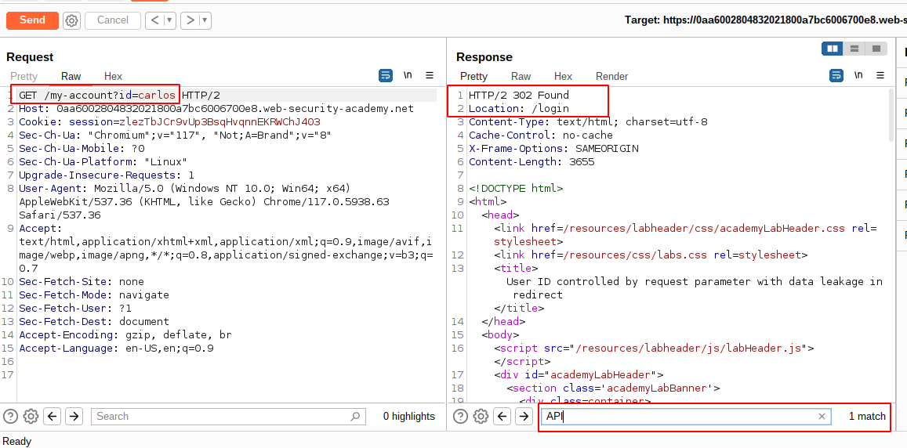
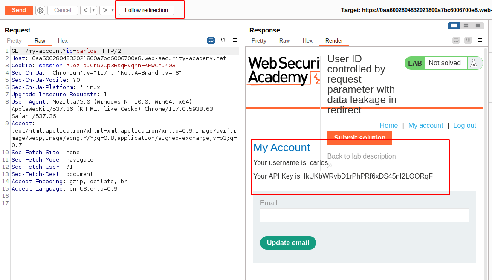

# Lab Description

This lab contains an access control vulnerability where **sensitive information** is leaked in the body of a **redirect response**.

To solve the lab, obtain the `API key` for the user `carlos` and submit it as the solution.

You can log in to your own account using the following credentials: `wiener:peter`

# Lab Solution

1. Log in using the `wiener:peter` credentials and access the account page. Again can be observed that parameter `id` is assigned an username as value `id=wiener`

2. Send the request to Burp Repeater and change the `id` parameter to `carlos`.

3. Observe that although the response is now redirecting you to the login page, it has a body containing the `API key` belonging to `carlos`.
.

4. Submit the `API key`.
