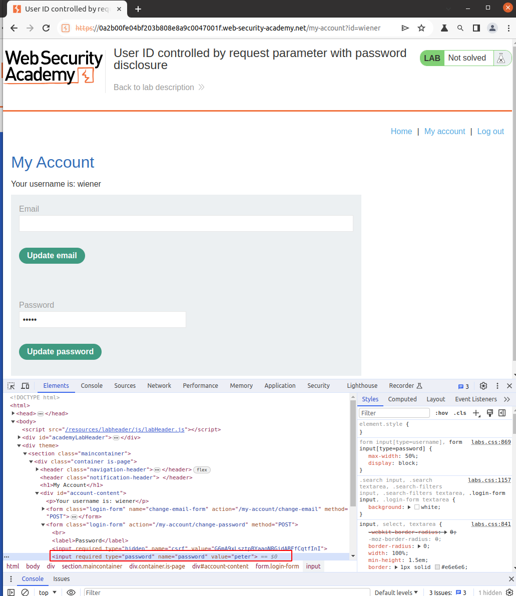
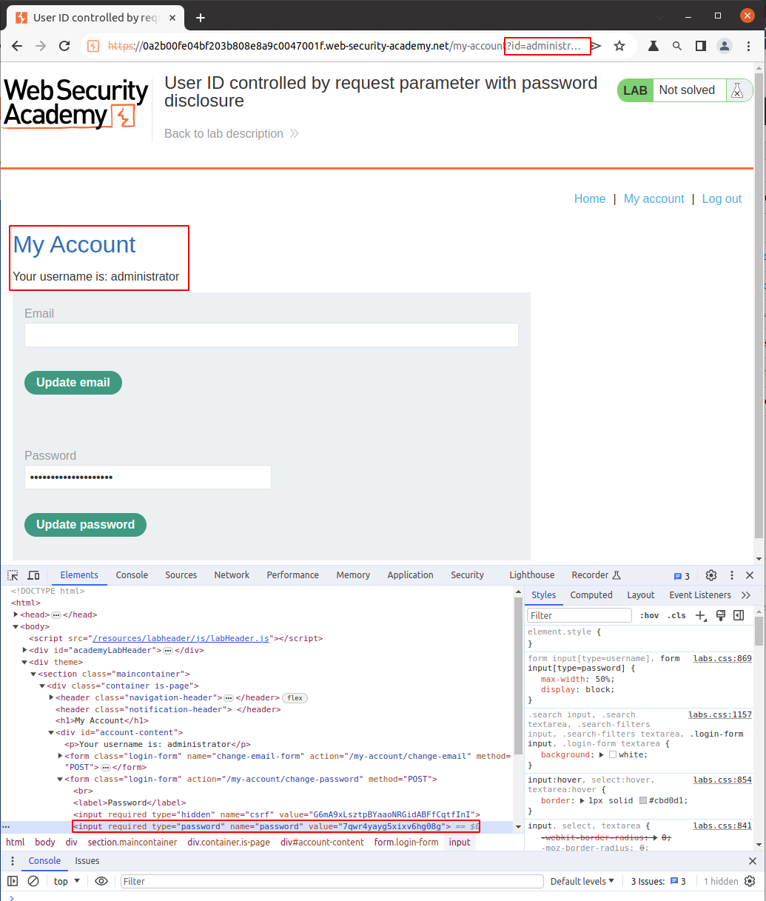
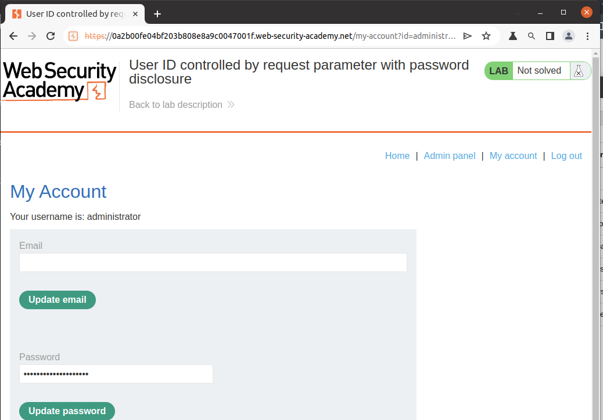
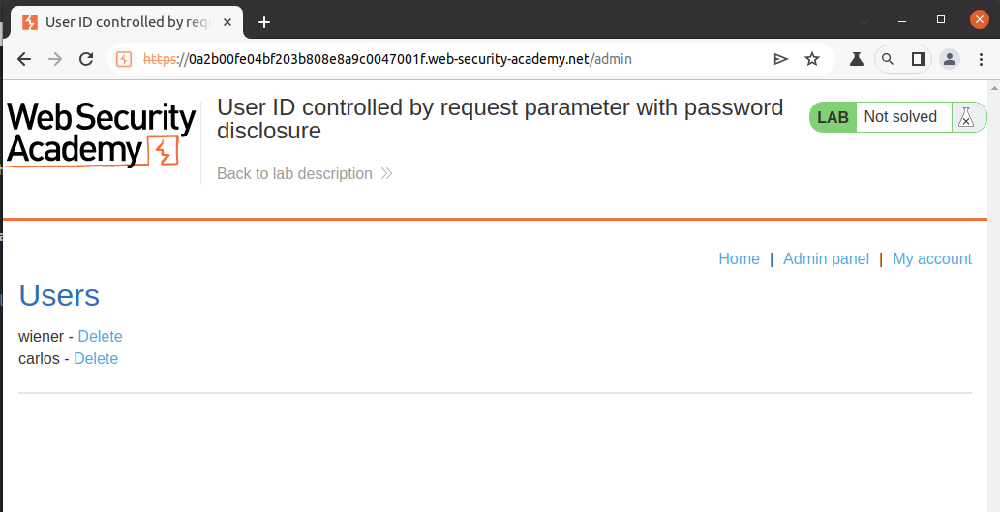
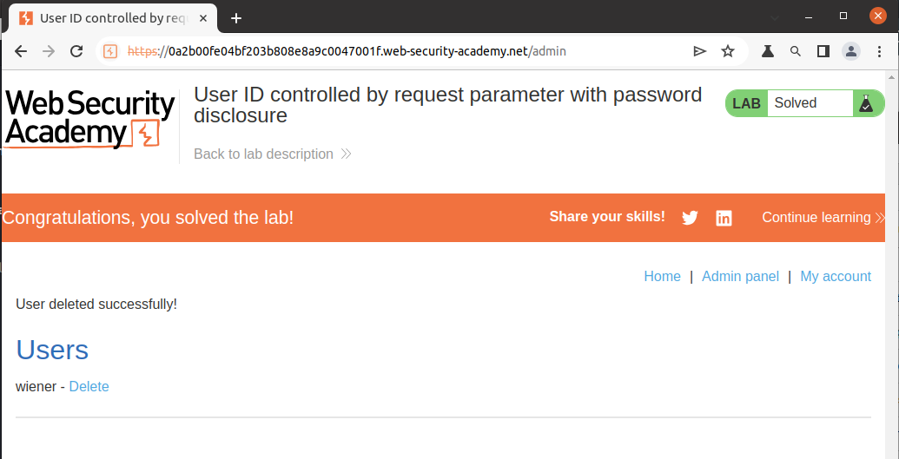

# Lab Description

This lab has user **account page that contains the current user's existing password, prefilled in a masked input**.

To solve the lab, retrieve the **administrator's password**, then use it to **delete** the user `carlos`.

You can log in to your own account using the following credentials: `wiener:peter`

# Lab Solution

1. Log in using the supplied credentials and access the user account page. Inspect the prefilled `password` field.
.

2. Change the `id` parameter in the URL to `administrator`.

Write the value in the field `value="7qwr4yayg5xixv6hg08g"`. We can observe that despite the information belonging to the administrator, we still need access to the admin panel.

3. Log in to the administrator account using the obtained `password` `7qwr4yayg5xixv6hg08g`.

4. Access the `admin panel` and delete user `carlos`.
.

