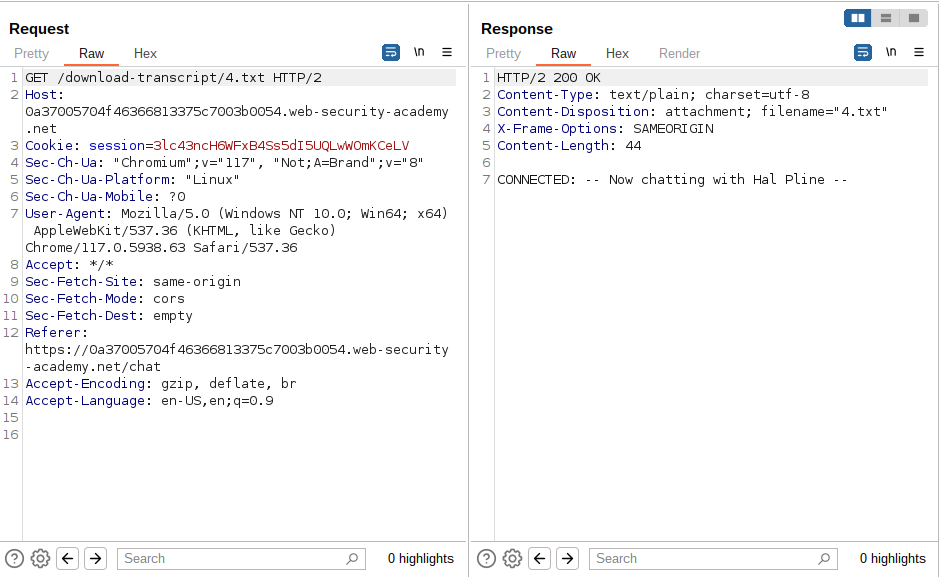
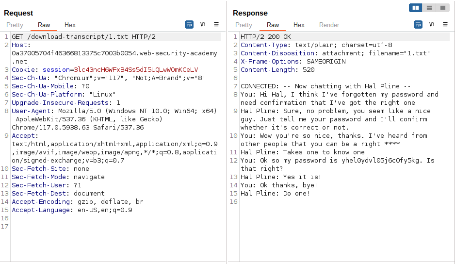
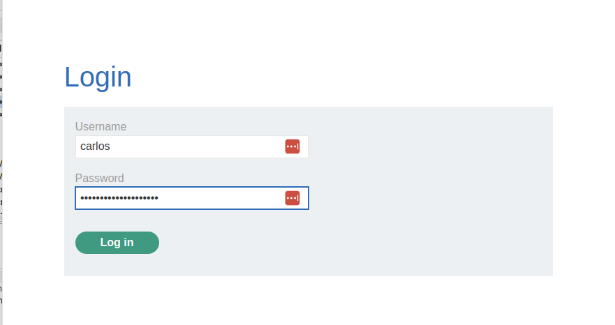
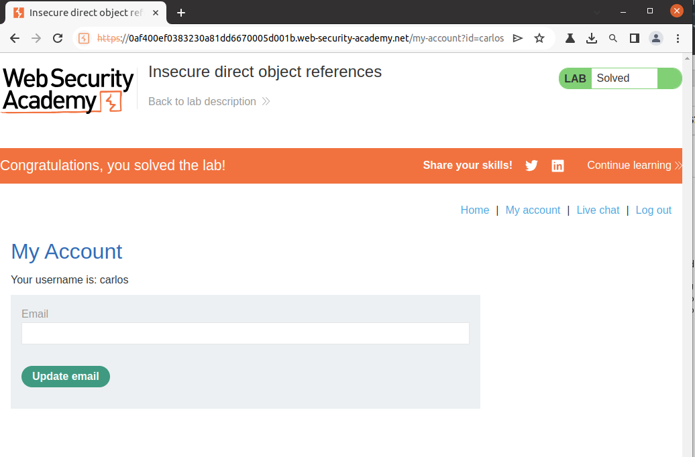

# Lab Description

This lab stores user **chat logs** directly on the server's file system, and retrieves them using static URLs.

Solve the lab by finding the `password` for the user `carlos`, and logging into their account.

# Lab Solution

1. Select the Live chat tab.

2. Send a message and then select View transcript or just select View transcript. Capture the request.

3. Review the URL and observe that the transcripts are text files assigned a filename containing an incrementing number.

4. Change the filename to 1.txt and review the text. Notice a password within the chat transcript.
Return to the main lab page and log in using the stolen credentials.

5. Return to the main lab page and log in using the stolen credentials.
.

