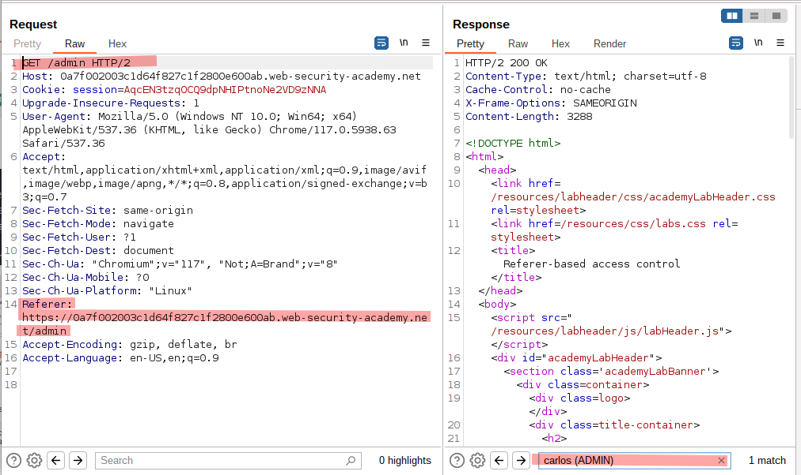

# Lab: Referer-based access control

## Lab Description

This lab controls access to certain admin functionality based on the `Referer header`. You can familiarize yourself with the admin panel by logging in using the credentials `administrator:admin`.

To solve the lab, log in using the credentials `wiener:peter` and **exploit the flawed access controls to promote yourself to become an administrator**.

## Lab Solution

Note: **Referrer-based access control** is a vulnerability found in web applications that use the HTTP `Referer` header for enforcing access control to sensitive data or functionality. Referrer-based access control is a **weak scheme** for access control that can easily be exploited to enable unauthorized access. Source: https://cs.brown.edu/courses/csci1660/wiki/attacks/Referrer-Based-Access-Control/

1. Log in as `administrator:admin` change to `Admin panel` and observe the HTTP request of upgrading `carlos` user to administrator.

2. Capture the request and observe that the upgrade request actually use `GET` method with path `/admin-roles?username=carlos&action=upgrade`

3. If the `Referer` header is deleted, the HTTP response change to `401 Unathorized` despite we are still logged as admin.

4. Log out from the `administrator` account, and log in the non-admin user `wiener`.

5. To finalize the lab, copy the non-admin user's `session cookie` into the captured upgrade request, change the username to `wiener`, and replay it.  
