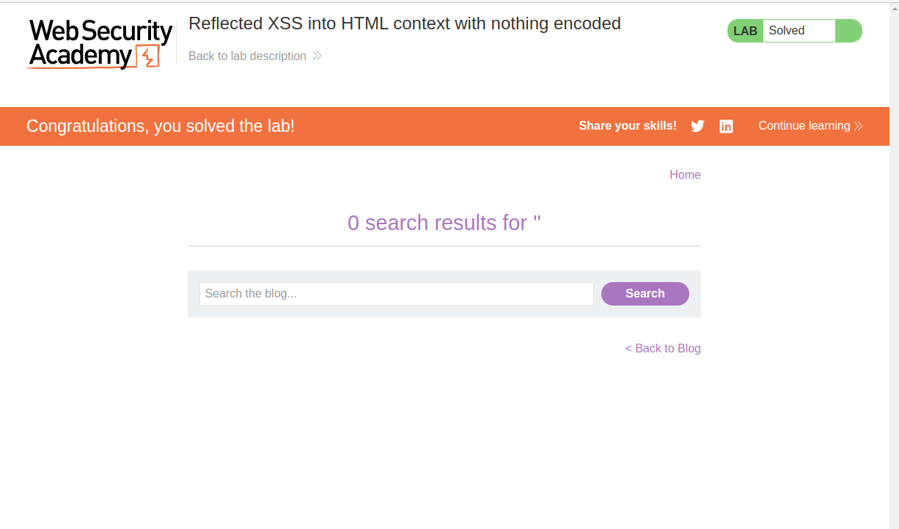

# Lab: Reflected XSS into HTML context with nothing encoded

## Lab Description

This lab contains **a simple reflected cross-site scripting vulnerability in the search functionality**.

To solve the lab, **perform a cross-site scripting attack that calls the `alert` function**.

## Lab Solution

**Lessons Learned**: Instead of handling the JavaScript carefully, it directly executes the `<script>` tags.

Reflected XSS into HTML context with nothing encoded == no input validation, no encoding, no filtering, directly processing what user submits

NOTE: Severity of XSS, is tightly tight with the amount of privileges the user has.

Because the result of the reflected XSS, is directly displayed in URL, we can send this link to anybody, who will then execute it. This is often used in phishing attacks, where an attacker might craft a malicious link and send it to potential victims to exploit the XSS vulnerability.

We can see also hat the injected script is getting embedded into the page's content by the server.

