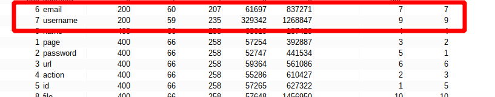

# Lab: Exploiting server-side parameter pollution in a query string

## Lab Description

To solve the lab, **log in as the `administrator` and delete `carlos`**.

Required knowledge
To solve this lab, you'll need to know:

- How to use URL query syntax to attempt to change a server-side request.
- How to use error messages to build an understanding of how a server-side API processes user input.

These points are covered in our API Testing Academy topic.

## Lab Solution

In Burp's browser, trigger a password reset for the administrator user.


In `Proxy > HTTP history`, notice the `POST /forgot-password` request and the related `/static/js/forgotPassword.js` JavaScript file.


Where an interesting part of the JavaScript `forgotPwdReady` function is mentioned instigating existence of `reset_token` parameter.

```
/ Execute the code when the DOM is ready.
forgotPwdReady(() => {
    // Extract reset token from query string
    const queryString = window.location.search;
    const urlParams = new URLSearchParams(queryString);
    const resetToken = urlParams.get('reset-token');
    // If a reset token is present in the query string, redirect to the forgot password page with the token
    if (resetToken) {
        window.location.href = `/forgot-password?reset_token=${resetToken}`;
    }
    // If no reset token is present, attach event listener to the "forgot password" button
    else {
        const forgotPasswordBtn = document.getElementById("forgot-password-btn");
        forgotPasswordBtn.addEventListener("click", displayMsg);
    }
});

```

Right-click the POST /forgot-password request and select Send to Repeater.

In the Repeater tab, resend the request to confirm that the response is consistent.


Change the value of the username parameter to `administrator`.


Change now an invalid username, such as `administratorx`. Send the request.


Notice that this results in an `Invalid username error message`.

Attempt to add a second parameter-value pair to the server-side request using a URL-encoded `&` character. For example, add URL-encoded `&x=y`:

`username=administrator%26x=y`


Send the request. Notice that this returns a `Parameter is not supported error message`. This suggests that the internal API may have interpreted `&x=y` as a separate parameter, instead of part of the username.

Attempt to truncate the server-side query string using a URL-encoded `#` character:

`username=administrator%23`


Send the request. Notice that this returns a `Field not specified` error message. This suggests that **the server-side query may include an additional parameter called field, which has been removed by the `#` character**.

Add a field parameter with an invalid value to the request. Truncate the query string after the added parameter-value pair. For example, add URL-encoded &field=x#:

`username=administrator%26field=x%23`

Send the request. Notice that this results in an `Invalid field` error message. This suggests that the server-side application may recognize the injected field parameter.


Brute-force the value of the field parameter:

`BurpSuite Professional`: Right-click the `POST /forgot-password` request and select `Send to Intruder`.
In the Intruder tab, add a payload position to the value of the field parameter as follows:

username=administrator%26field=§x§%23


In `Intruder > Payloads`, click Add from list. Select the built-in Server-side variable names payload list, then start the attack.

Or try using `TurboIntruder` for same functionality in `BurpSuite Community`


Review the results. Notice that the requests with the `username` and `email` payloads both return a `200` response.



Change the value of the field parameter from `x#` to `email`, but still keep the URL encoded `#` to truncate the rest of request.

`username=administrator%26field=email%23`

Send the request. Notice that this returns the original response. This suggests that email is a valid field type.


Now we return to the interesting part of the JavaScript `forgotPwdReady` function is mentioned instigating existence of `reset_token` parameter.

`/forgot-password?reset_token=${resetToken}`

In the `Repeater tab`, change the value of the field parameter from `email` to `reset_token`:

`username=administrator%26field=reset_token%23`

Send the request. Notice that this returns a password reset token. Make a note of this.


In Burp's browser, enter the password reset endpoint in the address bar. Add your password reset token as the value of the `reset_token` parameter.


Set a new password.


Log in as the administrator user using your password.


Go to the Admin panel.


And delete `carlos` to solve the lab


